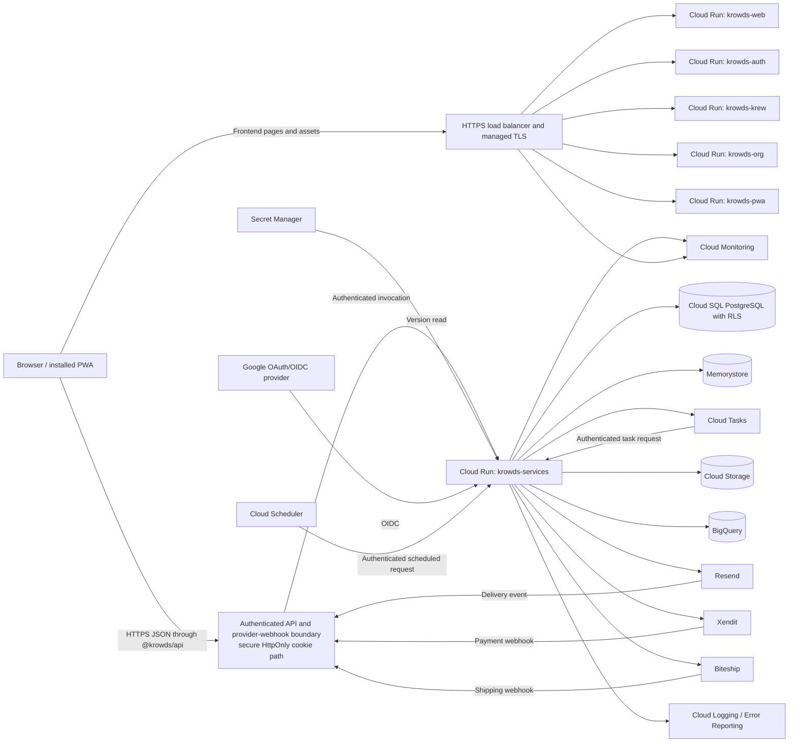

# KROWDS-ARCH-001 — Target System Architecture

## Metadata

| Field | Value |
| --- | --- |
| Document ID | `KROWDS-ARCH-001` |
| Version | `0.1` |
| Status | `Draft` |
| System | KROWDS |
| Owner | Platform Engineering (TBD) |
| Approver | Architecture Review Board (TBD) |
| Operational owner | SRE Lead (TBD) |
| Data owner | Data and Database Engineering (TBD) |
| Security owner | Security Engineering (TBD) |
| Last updated | `2026-09-24` |

## 1. Purpose and status

This document defines the target architecture for KROWDS on Google Cloud. Product behavior follows `KROWDS-PV-001` as the English canonical target and `KROWDS.md` as the Bahasa Indonesia product brief. This document covers repository boundaries, runtime topology, data ownership, security, scaling, failure behavior, observability, backup, and recovery.

This is a target-state baseline, not a statement that the managed infrastructure or all infrastructure adapters already exist. The current repository has five Next.js frontends, shared pnpm packages, one Go composition root, and a `services` build image. The current backend includes system metadata and health endpoints. Cloud SQL, Memorystore, Cloud Tasks, Cloud Scheduler, Cloud Storage, BigQuery, and other integrations are target responsibilities of Go infrastructure adapters under `services/`.

Normative terms **MUST**, **MUST NOT**, **SHOULD**, and **MAY** describe the intended architecture and deployment controls.

## 2. Scope

### 2.1 In scope

- Five browser-facing Next.js applications.
- One Go and Gin modular monolith deployed from one backend artifact.
- One isolated Google Cloud project for each of `krowds-dev`, `krowds-staging`, and `krowds-prod`.
- Regional deployment in `asia-southeast2`.
- Cloud Run, Cloud SQL for PostgreSQL, Memorystore, Cloud Tasks, Cloud Scheduler, Cloud Storage, Secret Manager, Cloud Logging, Cloud Monitoring, Cloud Error Reporting, and BigQuery.
- Terraform-managed infrastructure and GitHub Actions delivery.
- Time, identity, audit, observability, backup, rollback, and incident-management controls.

### 2.2 Out of scope

- Independent deployment of business modules.
- Next.js route handlers, Server Actions, backend middleware logic, databases, queues, or backend-only SDKs in `apps/*` or `packages/*`.
- A public multi-region active-active topology. The initial production design is regional in `asia-southeast2`.
- Replacing the Go backend with frontend server-side business logic.
- Making BigQuery or Memorystore a transactional system of record.
- Ticket transfer, re-entry, multi-use entitlements, custom organization roles, international shipping, cash on delivery, offline gate access, or another payment mode outside the IDR-only commercial policy.

### 2.3 Repository and runtime boundary

| ID | Control | Owner |
| --- | --- | --- |
| KROWDS-ARCH-010 | `apps/*` MUST contain frontend rendering, navigation, UI state, and browser-facing flow only. It MUST NOT contain Next.js route handlers, Server Actions, backend `proxy.ts` or `middleware.ts` logic, databases, queues, or backend-only SDKs. | Frontend Engineering (TBD) |
| KROWDS-ARCH-011 | Frontend requests to KROWDS APIs MUST pass through `@krowds/api`. The PWA service worker's fetch handling is the only framework-specific exception. | Frontend Engineering (TBD) |
| KROWDS-ARCH-012 | Go and Gin under `services/` MUST exclusively own backend HTTP APIs, authentication, authorization, persistence, queues, and business workflows. | Backend Engineering (TBD) |
| KROWDS-ARCH-013 | The backend MUST remain one modular monolith with one composition root and one deployable artifact built from `services/cmd/server`. Cloud Run may create multiple replicas, but all replicas MUST run the same artifact. | Backend Engineering (TBD) |
| KROWDS-ARCH-014 | `packages/*` MUST contain shared frontend contracts, UI, validation, hooks, and utilities only. Shared packages MUST NOT become a second backend or own operational data. | Frontend Engineering (TBD) |
| KROWDS-ARCH-015 | Domain and application code MUST remain independent of Gin, delivery, infrastructure, databases, queues, and external providers. Delivery and infrastructure MUST depend inward through application ports. | Backend Engineering (TBD) |
| KROWDS-ARCH-016 | A business module MUST NOT import another business module's implementation. Pure cross-module contracts and events MUST use `internal/contracts` or `internal/events`. | Backend Engineering (TBD) |
| KROWDS-ARCH-017 | `pnpm test:architecture` and code review MUST enforce the repository boundary. Internal packages are compiled into frontend applications and are not separately deployed. | Platform Engineering (TBD) |

## 3. Architecture decisions

| ID | Decision | Rationale | Owner |
| --- | --- | --- | --- |
| KROWDS-ARCH-020 | Use five independent Next.js Cloud Run services: Web, Auth, Krew, Org, and PWA. | Preserves product separation while retaining one frontend architecture and shared package system. | Frontend Engineering (TBD) |
| KROWDS-ARCH-021 | Use one Go and Gin Cloud Run service and one backend image for all business modules. | Keeps business transactions and workflows in one transaction boundary without creating independently deployed services. | Backend Engineering (TBD) |
| KROWDS-ARCH-022 | Isolate development, staging, and production in separate Google Cloud projects. | Limits identity, data, secret, quota, and deployment blast radius. | Platform Engineering (TBD) |
| KROWDS-ARCH-023 | Place regional runtime resources in `asia-southeast2`. | Establishes one operating and compliance region for the initial deployment. | Platform Engineering (TBD) |
| KROWDS-ARCH-024 | Use Cloud SQL for PostgreSQL as the transactional system of record. | Provides managed backups, high availability, patching, and private connectivity. | Data and Database Engineering (TBD) |
| KROWDS-ARCH-025 | Use Memorystore only for rebuildable cache, short-lived coordination, and rate-limit data unless a separate design review approves another use. | Avoids making ephemeral state authoritative for business transactions. | Backend Engineering (TBD) |
| KROWDS-ARCH-026 | Use Cloud Tasks and Cloud Scheduler to invoke task and scheduler routes on the same Go service. | Provides asynchronous delivery and schedules without creating a second deployable backend. | Backend Engineering (TBD) |
| KROWDS-ARCH-027 | Use Cloud Storage for private object data, exports, and backup artifacts; use BigQuery for analytics, not operational writes. | Keeps object and analytical workloads separate from transactional truth. | Data and Database Engineering (TBD) |
| KROWDS-ARCH-028 | Provision environment infrastructure with Terraform and deploy application revisions with GitHub Actions. | Makes infrastructure reviewable and release promotion auditable. | Platform Engineering (TBD) |
| KROWDS-ARCH-029 | Store and process timestamps in UTC; render user-facing dates in `Asia/Jakarta`. | Prevents daylight-saving and cross-region ambiguity while matching the primary display locale. | Backend Engineering (TBD) |
| KROWDS-ARCH-030 | Keep the phased MVP online-first, IDR-only, and single-use. Do not imply offline gate access, transfer, re-entry, or multi-use behavior. | Preserves the approved product boundary and its anti-replay rules. | Product Owner and Backend Engineering Lead (TBD) |
| KROWDS-ARCH-031 | Use PostgreSQL shared-schema tenancy with `organization_id`, Row-Level Security, and RLS enforcement forced for the runtime role. | Makes tenant isolation enforceable below the application layer. | Backend and Database Engineering (TBD) |
| KROWDS-ARCH-032 | Use Xendit for payment state, Resend for transactional email, and Biteship for domestic shipping state. | Keeps each external authority behind an authenticated, idempotent, replay-resistant, and auditable Go adapter. | Platform Integration Engineering (TBD) |
| KROWDS-ARCH-033 | Require an incident record with UTC timestamps for every declared production incident. | Creates one operational history of impact, decisions, evidence, recovery, and follow-up. | SRE Lead (TBD) |

## 4. System context and trust boundaries



The browser-to-API path is HTTPS through the approved API gateway/identity-aware path. Go owns the session; the browser holds only secure HttpOnly SameSite cookies and never a raw access or refresh token. Direct anonymous Cloud Run invocation is rejected. A Next.js frontend MUST NOT proxy, rewrite, or implement a business API through Next.js middleware or a server route.

Provider webhooks enter through the approved public API and provider-webhook boundary and reach dedicated backend routes. Edge routing MUST NOT replace application-level provider signature, timestamp, replay, body-size, or idempotency verification.

The external load balancer routes public hostnames to the approved ingress and Cloud Run. Backend and frontend origins, CORS rules, service accounts, provider credentials, and trust boundaries are environment-specific. Cloud Run direct anonymous invocation is prohibited.

## 5. Target deployment topology

### 5.1 Project isolation

| Environment | Google Cloud project | Primary region | Data policy | Runtime dependencies |
| --- | --- | --- | --- | --- |
| Development | `krowds-dev` | `asia-southeast2` | Synthetic or masked data only; disposable within approved retention | Independent Cloud Run, Cloud SQL, Memorystore, storage, secrets, tasks, scheduler, and BigQuery resources |
| Staging | `krowds-staging` | `asia-southeast2` | Sanitized or synthetic production-like data; never production personal data | Independent resources matching the production topology at reduced capacity |
| Production | `krowds-prod` | `asia-southeast2` | Approved production data and retention policy | Independent resources with high availability, backups, and restricted operations access |

Each project MUST use its own service identities, Artifact Registry repositories, encryption and network policies, database credentials, secrets, buckets, queues, scheduler jobs, logs, and BigQuery datasets. Explicit regional locations use `asia-southeast2`; global Google edge and logging controls remain project-scoped and MUST NOT export data to an unapproved region. Cross-project runtime traffic is not required. Promotion MUST use immutable artifacts and explicit deployment automation rather than shared runtime resources.

### 5.2 Components in each project

| Component | Google Cloud resource | Responsibility | Scaling or availability posture |
| --- | --- | --- | --- |
| Web | Cloud Run `krowds-web` | Public web frontend | Independently autoscaled; minimum and maximum instances controlled per environment |
| Auth | Cloud Run `krowds-auth` | Login, registration, and session UI | Independently autoscaled; never owns final authentication decisions |
| Krew | Cloud Run `krowds-krew` | Internal KREW workspace UI | Independently autoscaled; access controlled by backend APIs |
| Org | Cloud Run `krowds-org` | Organization workspace UI | Independently autoscaled; tenant rules enforced by backend |
| PWA | Cloud Run `krowds-pwa` | Installable web application and service-worker delivery | Independently autoscaled; the offline shell never grants IDR-only business or gate decisions |
| Services | Cloud Run `krowds-services` | All backend modules, API delivery, provider orchestration, task endpoints, and scheduler endpoints | Multiple replicas of one image; bounded by database and dependency capacity |
| PostgreSQL | Cloud SQL for PostgreSQL | Transactional source of truth with shared-schema organization tenancy and forced RLS | Regional high availability in production; runtime role cannot bypass RLS; bounded connections; automated backup and point-in-time recovery |
| Cache | Memorystore for Redis | Rebuildable cache and bounded ephemeral coordination | Production availability and capacity selected after load testing; never sole durable business record |
| Work queue | Cloud Tasks queues | At-least-once asynchronous delivery to `krowds-services` | Retry and rate limits defined per workload; task handlers are idempotent |
| Schedules | Cloud Scheduler jobs | Trigger known scheduled use cases on `krowds-services` | Authenticated invocation; explicit timezone and overlap policy |
| Objects | Cloud Storage buckets | Artwork, organization documents, exports, migration artifacts, and database backup files | Regional buckets, private access, versioning where required, lifecycle and retention policies |
| Secrets | Secret Manager | Database credentials, signing keys, provider credentials, and other sensitive values | Per-project versions; service-account access only; rotation evidence retained |
| Telemetry | Cloud Logging, Cloud Monitoring, Cloud Error Reporting | Logs, metrics, alerts, exception grouping, and operational evidence | Retained according to environment policy; correlated by request and revision identifiers |
| Analytics | BigQuery datasets | Sanitized audit, operational, and product analytics | Not queried as a transactional source of truth; access and retention controlled separately |

## 6. Repository architecture

```text
apps/
├── web/       # Cloud Run krowds-web
├── auth/      # Cloud Run krowds-auth
├── krew/      # Cloud Run krowds-krew
├── org/       # Cloud Run krowds-org
└── pwa/       # Cloud Run krowds-pwa

packages/
├── api/       # browser-to-backend client boundary
├── types/     # shared frontend types
├── validation/
├── hooks/
├── utils/
├── ui/
├── tsconfig/
└── eslint-config/

services/
├── cmd/server/                         # sole production composition root
└── internal/
    ├── config/
    ├── contracts/                     # pure cross-module values, when needed
    ├── events/                        # pure cross-module events, when needed
    ├── modules/<module>/
    │   ├── application/
    │   ├── delivery/http/
    │   ├── domain/
    │   ├── infrastructure/
    │   └── module.go
    ├── platform/
    └── transport/http/
```

Each backend module retains the dependency direction:

```text
delivery/http ───────► application ports ───────► domain
infrastructure ──────► application ports
domain ──────────────► pure Go standard-library types only
```

Modules are registered through the transport `Module` interface and composed in `services/cmd/server/main.go`. Technical wiring remains at the edge. A module split MUST remain a code and test organization decision unless a new architecture decision explicitly changes the one-binary rule.

## 7. Runtime flows

### 7.1 Synchronous browser request

1. The browser loads a page from the relevant Next.js Cloud Run service.
2. The frontend constructs an API client through `@krowds/api` with the environment's public API origin.
3. The browser sends HTTPS JSON through the approved authenticated API boundary allowed by CORS.
4. Gin delivery code validates transport input, establishes organization context from the authenticated session, and invokes an application command or query.
5. Application code enforces fixed-role permissions and business rules through domain objects and ports.
6. The database transaction sets tenant context before querying PostgreSQL; forced RLS independently rejects cross-organization access.
7. Infrastructure adapters use Cloud SQL, Memorystore, Cloud Storage, Resend, Xendit, Biteship, or other approved dependencies.
8. Delivery code returns the HTTP result and request identifier.

The load balancer and frontend MUST NOT become the authorization authority. Backend APIs MUST authenticate and authorize every protected operation.

### 7.2 Asynchronous task

1. An application use case writes durable business state and an outbox or equivalent durable dispatch record where delivery must be coordinated with a transaction.
2. Infrastructure code enqueues a Cloud Task with a stable task identifier and an authenticated target.
3. Cloud Tasks invokes the task route on the same `krowds-services` artifact.
4. The handler validates identity, task age, payload version, and idempotency before changing state.
5. Transient failures are retried with bounded exponential backoff. Permanent failures are recorded for review and must not loop indefinitely.
6. Business state is committed before success is acknowledged.

A task route is not a separate worker deployment. The queue improves delivery elasticity but does not weaken exactly-once business behavior; handlers must be safe under at-least-once delivery.

### 7.3 Provider webhook

1. Xendit, Resend, or Biteship sends an event to a dedicated HTTPS webhook route on `krowds-services`.
2. The route enforces body limits and verifies the provider-supported signature or token, timestamp or replay window, and expected destination before parsing business state.
3. The verified event is written to a durable inbox with a unique provider event ID before a successful acknowledgement.
4. A duplicate event ID is a safe no-op. An authenticated but stale, mismatched, or out-of-order event enters reconciliation rather than changing an invalid state.
5. Processing may enqueue a Cloud Task, but the durable inbox and database state remain the recovery sources.
6. Xendit is authoritative for payment state, Resend for transactional delivery status, and Biteship for domestic shipping state. A browser redirect or manual status never overrides those authorities.

### 7.4 Scheduled job

1. Cloud Scheduler invokes a dedicated scheduler route on `krowds-services` using workload identity and an authenticated audience.
2. The route validates the caller, environment, expected schedule, and overlap condition.
3. The use case records the execution key and performs the scheduled work idempotently.
4. The result, duration, and correlation identifier are logged and measured.

Jobs that overlap MUST use a durable execution lock or equivalent database guard. A missed schedule MUST be safe to retry manually.

### 7.5 Object and analytics flow

1. The backend authorizes object access and creates or retrieves objects through the Cloud Storage adapter.
2. Bucket names are not accepted as unrestricted user input.
3. Organization legal documents, artwork, private production CSVs, and exports use separate reviewed object boundaries and short-lived authorized access.
4. A production CSV contains only `batch_id`, `wristband_code`, `qr_payload`, and `schema_version`; it contains no personal data. The QR payload is an opaque random credential, and the database stores its protected hash rather than the readable token.
5. Sanitized operational or audit events are loaded into BigQuery for analysis.
6. BigQuery results never authorize a live transaction or overwrite the Cloud SQL source of truth.

## 8. Data architecture

| ID | Control | Owner |
| --- | --- | --- |
| KROWDS-ARCH-040 | Cloud SQL MUST be the authoritative store for identities, organizations, entitlements, tickets, KROWDS payment references, wristband state, and transactional audit state. Xendit remains authoritative for payment state. | Data and Database Engineering (TBD) |
| KROWDS-ARCH-041 | Memorystore data MUST support cache, rate limiting, short-lived locks, and idempotency coordination but MUST remain reproducible or safely recreatable. It is not the sole durable business record. | Backend Engineering (TBD) |
| KROWDS-ARCH-042 | Cloud Storage objects MUST be private, environment-isolated, encrypted, access-logged, and governed by lifecycle or retention rules. | Data and Database Engineering (TBD) |
| KROWDS-ARCH-043 | BigQuery MUST receive only approved datasets with documented classification, retention, and deletion behavior. | Data and Database Engineering (TBD) |
| KROWDS-ARCH-044 | Every tenant-owned table MUST include `organization_id`, enable RLS, and force RLS for the runtime role. The runtime identity MUST NOT own tenant tables or have `BYPASSRLS`. | Backend and Database Engineering (TBD) |
| KROWDS-ARCH-045 | The Go backend MUST derive tenant context from the authenticated session and set it transactionally for database access. Missing or mismatched organization context MUST fail closed. Cross-organization operations MUST use a separately authorized service and auditable use case. | Backend Engineering (TBD) |
| KROWDS-ARCH-046 | The MVP MUST remain online-first, IDR-only, and single-use. A ticket or wristband transition MUST be atomic so concurrent or repeated redemption and access cannot succeed more than once. | Product and Backend Engineering (TBD) |
| KROWDS-ARCH-047 | Ticket-holder data becomes immutable after successful payment. Transfer, re-entry, multi-use, and offline gate decisions are prohibited in the MVP. | Backend Engineering (TBD) |
| KROWDS-ARCH-048 | Every database timestamp MUST represent an instant. Go values and persisted `timestamptz` values use UTC. API timestamps use RFC 3339 with an explicit offset. Cloud Scheduler definitions use the explicit `Asia/Jakarta` business timezone while execution records and logs remain UTC. | Backend Engineering (TBD) |
| KROWDS-ARCH-049 | Frontends MUST display persisted instants in `Asia/Jakarta` and MUST label the timezone when ambiguity would affect a decision. Business dates that are not instants MUST store their explicit business-date semantics. | Frontend Engineering (TBD) |
| KROWDS-ARCH-050 | Logs, metrics, task payloads, incident records, and analytics exports MUST exclude secrets, authentication tokens, full identity numbers, raw QR payloads, payment credentials, and unnecessary personal data. | Security Engineering (TBD) |

### 8.1 Data authority

- **Cloud SQL:** authoritative business records and audit transactions.
- **Memorystore:** acceleration and bounded ephemeral state only.
- **Cloud Storage:** binary objects and backup or export artifacts.
- **BigQuery:** analytical copies and governed reporting datasets.
- **Secret Manager:** current and historical secret versions.
- **Cloud Logging and Error Reporting:** operational telemetry, not business records.

## 9. Security architecture

| ID | Control | Owner |
| --- | --- | --- |
| KROWDS-ARCH-052 | Serving, background work, migration, and operator access MUST use separate least-privilege identities. Human deployment identities and downloadable service-account keys are prohibited for normal operation. | Security Engineering (TBD) |
| KROWDS-ARCH-053 | Cloud SQL and Memorystore MUST use private connectivity and MUST NOT expose public database or cache IPs. | Platform Engineering (TBD) |
| KROWDS-ARCH-054 | Secrets MUST be stored in Secret Manager and injected through workload identity and secret references. Secrets MUST NOT be committed, printed in CI, or included in images. | Security Engineering (TBD) |
| KROWDS-ARCH-055 | Authentication, fixed-role authorization, organization scope, and permission checks MUST be implemented in the Go backend. Frontend route guards are usability controls only. | Backend Engineering (TBD) |
| KROWDS-ARCH-056 | CORS MUST list only the exact frontend origins for one environment. Wildcard origins MUST NOT be combined with credentials. | Backend Engineering (TBD) |
| KROWDS-ARCH-057 | Cloud Run backend invocation MUST be authenticated. Task and scheduler entry points MUST verify callers, expected audiences, payload size, and replay or overlap controls. | Backend and Platform Engineering (TBD) |
| KROWDS-ARCH-058 | Xendit, Resend, and Biteship webhooks MUST use dedicated routes and provider-supported verification, a durable inbox, unique event IDs, replay controls, and auditable processing before acknowledgement. | Platform Integration Engineering (TBD) |
| KROWDS-ARCH-059 | Payment state and wristband activation MUST follow verified Xendit or system callbacks; manual staff confirmation MUST NOT replace required digital confirmation. KROWDS MUST NOT store raw card data. | Payments Engineering (TBD) |

TLS terminates at Google Cloud edge services and traffic between supported services uses Google Cloud's encrypted network. Encryption at rest is enabled for all managed stores and buckets.

## 10. Scaling and capacity

### 10.1 Scaling controls

| ID | Control | Owner |
| --- | --- | --- |
| KROWDS-ARCH-060 | Each Cloud Run service MUST have an explicit minimum instance count, maximum instance count, concurrency, CPU, memory, request timeout, and maximum request size for its environment. | SRE Lead (TBD) |
| KROWDS-ARCH-061 | Production backend scaling MUST be bounded by a documented Cloud SQL connection and CPU budget. Autoscaling MUST NOT be allowed to exhaust the database. | Data and Database Engineering (TBD) |
| KROWDS-ARCH-062 | Cloud Run revisions MUST drain in-flight requests before shutdown. Request timeouts and client deadlines MUST leave time for graceful termination. | Backend Engineering (TBD) |
| KROWDS-ARCH-063 | Asynchronous queues MUST use workload-specific dispatch rates, retry limits, and concurrency so a backlog cannot starve interactive traffic. | Backend Engineering (TBD) |
| KROWDS-ARCH-064 | Scheduler jobs that can overlap MUST use a durable lock and a bounded retry policy. Large schedules MUST be staggered. | Backend Engineering (TBD) |
| KROWDS-ARCH-065 | Capacity changes MUST be based on load-test evidence and production trends. Scaling limits and database tiers are approved by the SRE Lead and Data and Database Engineering before production use. | SRE Lead (TBD) |

### 10.2 Capacity model

At minimum, capacity reviews MUST evaluate:

- requests per second and concurrent sessions;
- p50, p95, and p99 API latency;
- backend CPU, memory, and request concurrency;
- Cloud SQL CPU, storage, replication lag, and connection utilization;
- Memorystore memory, evictions, latency, and failover events;
- Cloud Tasks queue depth, oldest-task age, dispatch rate, and failure count;
- Cloud Storage upload and download errors;
- frontend build and serving latency;
- payment provider and identity provider latency.

The initial production service SHOULD keep at least two backend instances so a maintenance event or instance loss does not reduce capacity to zero. Exact limits remain owned by SRE and database operations and MUST be recorded in `KROWDS-DEP-DOC-001` before launch.

## 11. Failure model

| Failure | Expected behavior | Isolation | Detection | Recovery |
| --- | --- | --- | --- | --- |
| One frontend revision fails | Other frontend services remain available. The affected route returns a safe error state. | Per-service Cloud Run revision | Frontend 5xx, load-balancer health, Cloud Error Reporting, synthetic checks | Route traffic to the last known revision; disable the bad feature; redeploy a fixed digest |
| Backend instance exits | Cloud Run replaces it while healthy instances continue serving. | One Cloud Run instance | Revision instance count, 5xx, latency, error logs | Automatic replacement; investigate image, memory, or process failure |
| All backend instances fail | Frontends remain loadable but protected workflows fail without claiming business success. Offline behavior never grants gate access. | One backend service | Readiness failure, 5xx burn rate, alert | Roll back traffic, scale within limits, suspend optional load, restore dependencies |
| Cross-organization data is requested or observed | PostgreSQL RLS denies access or the backend fails closed; the request is audited. | Tenant policy, application authorization, and database RLS | RLS-denial metric, cross-tenant test, security alert | Stop the affected path, preserve evidence, revoke excess access, correct tenant context or policy, and verify isolation |
| Cloud SQL is unavailable or saturated | New transactions fail safely. The system MUST NOT acknowledge an uncommitted payment, ticket, wristband, or access decision. | Database adapter, RLS, and connection pool | Cloud SQL metrics, query errors, connection saturation | Stop nonessential tasks, reduce backend replicas, fail over when eligible, restore service, replay safe work |
| Memorystore is unavailable | Cached reads use approved authoritative behavior. Durable state and atomic database transitions are not lost. | Cache adapter | Redis health, latency, evictions, error rate | Bypass or rebuild cache; scale or restart through approved procedure; verify cache-aside and idempotency behavior |
| Cloud Tasks is unavailable | Outbox or task state remains durable; work is delayed, not silently discarded. | Queue adapter | Enqueue errors, oldest-task age, task failures | Repair IAM or quota, resume dispatch, replay idempotently, inspect permanent failures |
| Cloud Scheduler fails | A scheduled run is missing and visibly late. It is not silently marked successful. | Scheduler route and durable run record | Job execution history, schedule alert | Run the same idempotent job manually after verifying no active execution |
| Xendit is unavailable or a webhook is invalid | Payment remains pending or enters reconciliation. No ticket or wristband becomes paid or active. | Payments adapter and durable webhook inbox | Provider latency, signature failures, event lag, mismatch cases | Restore provider access, replay verified durable events, reconcile references, and alert Payments Engineering |
| Resend is unavailable | Transactional messages remain pending or retry within policy. OTP, payment, ticket, and identity state do not change from an email result. | Notification adapter | Send latency, 429, bounce, complaint, backlog | Restore provider access, replay idempotently, apply suppression rules, and use only approved fallback communication |
| Biteship is unavailable | A physical order remains pending or operationally blocked. Delivery is never inferred. | Fulfillment adapter | Shipment creation latency, webhook lag, COD-block signals | Restore provider access, reconcile by idempotency key, replay verified events, and alert Fulfillment Operations |
| Cloud Storage is unavailable | Document or export operations fail safely; unrelated API traffic continues. | Storage adapter | Storage error rate, operation latency, access logs | Restore IAM or service availability, retry with bounded backoff, preserve partial-file cleanup rules |
| Secret Manager or configuration is invalid | New revisions fail startup or readiness without exposing secret values. | Startup configuration | Revision startup logs, health checks, secret access metrics | Restore access or configuration, deploy a corrected revision, rotate exposed values if required |
| Bad release | Previous compatible revision remains available. | Immutable image digests and schema compatibility | Automated post-deploy checks and alerts | Shift traffic back; apply a forward fix or approved data rollback |
| Regional GCP disruption | The regional design has reduced or no service availability. | `asia-southeast2` regional dependency | Google Cloud service health and internal saturation | Declare P1, open an incident record, follow the approved regional recovery or rebuild plan; do not improvise an unapproved cross-region cutover |

## 12. Observability

### 12.1 Logging

- The Go backend writes structured JSON to standard output for Cloud Run ingestion.
- Every request has a request identifier. The backend preserves a valid incoming `X-Request-ID` and returns it to the client.
- Frontend logs, load-balancer logs, Cloud Run logs, task logs, and scheduler logs use the same request, trace, deployment, and environment labels where available.
- Log records use UTC timestamps.
- Sensitive payloads, credentials, full identity documents, and payment data are prohibited.
- Retention and log sinks are configured per project. Production log exports to BigQuery MUST be redacted and access-controlled.

### 12.2 Metrics and alerts

Required signals include:

- request count, error count, error ratio, and latency by frontend and backend;
- active, starting, and terminated Cloud Run instances;
- Cloud SQL CPU, storage, connections, replication health, slow query indicators, RLS denials, and abnormal cross-organization access attempts;
- Memorystore CPU, memory, evictions, latency, and connection count;
- Cloud Tasks enqueue, dispatch, retry, failure, depth, and oldest-task age;
- Cloud Scheduler execution status and missed-run count;
- Cloud Storage operation errors, unexpected bulk access, and object lifecycle failures;
- frontend Core Web Vitals or equivalent browser experience signals;
- Xendit payment creation, verified webhook, duplicate, replay, mismatch, refund, and reconciliation signals;
- Resend send, delivery, bounce, complaint, suppression, and rate-limit signals;
- Biteship label, tracking, delivery, and no-COD enforcement signals; and
- Google OAuth/OIDC provider OIDC validation, account-linking, and provider failure signals.

Alerts MUST route to the responsible on-call role and link to the relevant procedure in `KROWDS-RUN-001`. Multi-window burn-rate alerts are preferred for service-level failures. Capacity alerts are required before a hard limit is reached.

### 12.3 Error Reporting

Cloud Error Reporting groups unhandled exceptions and repeated stack signatures from Cloud Run logs. Each production error group requires triage, an owner, severity, and either a corrective action or an accepted-risk record.

### 12.4 Tracing

Trace context SHOULD be propagated from the edge through the frontend request to the backend and asynchronous work. Trace and request identifiers MUST be retained in task and scheduler records. Trace sampling may be reduced in production only if required fields remain available in structured logs and Error Reporting.

### 12.5 Service levels

Availability, latency, RPO, and RTO targets are defined in `NFR.md` and section 15 of `PRODUCT-VISION.md`. Before production launch, the SRE Lead and Product Owner (TBD) MUST verify the approved baselines with load tests and restore evidence.

## 13. Backup, recovery, and retention

| ID | Control | Owner |
| --- | --- | --- |
| KROWDS-ARCH-070 | Production Cloud SQL MUST use regional high availability, automated backups, point-in-time recovery, and a tested restore process. | Data and Database Engineering (TBD) |
| KROWDS-ARCH-071 | Automated backup retention is 7 days for development, 14 days for staging, and 35 days for production. The Data Owner (TBD) reviews the schedule before launch and may extend it for a documented legal or recovery requirement. | Data Owner (TBD) |
| KROWDS-ARCH-072 | Production backup and restore drills MUST run at least quarterly. Staging restore evidence MUST be reviewed after material database changes. | Data and Database Engineering (TBD) |
| KROWDS-ARCH-073 | Memorystore does not replace database backup. Recovery MUST rebuild cache state from PostgreSQL and approved configuration. | Backend Engineering (TBD) |
| KROWDS-ARCH-074 | Cloud Storage versioning, retention, and lifecycle rules MUST match document and export classification. Backup objects MUST have a separate retention policy. | Data Owner (TBD) |
| KROWDS-ARCH-075 | BigQuery dataset retention, deletion, and access MUST be explicit. Analytics deletion does not substitute for deletion in the operational system. | Data and Database Engineering (TBD) |
| KROWDS-ARCH-076 | Secret versions required by a deployed revision MUST remain available until that revision and its rollback window are retired. | Security Engineering (TBD) |

RPO for the primary transactional store is 15 minutes and RTO is 4 hours, with quarterly restore drills and the 7/14/35-day backup schedule. A single-region architecture cannot guarantee recovery from loss of `asia-southeast2`; cross-region DR is post-MVP or requires a separate approved decision before production expansion.

## 14. Deployment and change model

- Terraform owns durable environment resources, IAM baselines, network policy, managed service configuration, backup policy, and monitoring resources.
- GitHub Actions owns validation, image build, artifact promotion, migration execution, Cloud Run revision deployment, smoke checks, and release evidence.
- Application revisions are identified by commit SHA and image digest, not mutable tags.
- A production release requires an approved change, a verified migration strategy, a rollback point, and an assigned operations owner.
- Database changes follow expand, migrate, contract sequencing. A deployment MUST NOT combine an irreversible schema change with the only application rollback path.
- Production deployment and rollback procedures are defined in `KROWDS-DEP-DOC-001`.
- Operational response and restoration procedures are defined in `KROWDS-RUN-001`.

## 15. Open decisions

| ID | Decision required | Owner | Required before |
| --- | --- | --- | --- |
| KROWDS-ARCH-090 | Accepted production SLOs, starting alert thresholds, and operational response objectives; named destinations and evidence remain release gates | SRE Lead and Product Owner (TBD) | Production launch |
| KROWDS-ARCH-091 | Final Cloud SQL and Memorystore machine classes, connection budget, and storage growth plan | Data and Database Engineering (TBD) | Infrastructure apply |
| KROWDS-ARCH-092 | Database migration tool, lock policy, RLS role design, and expand-and-contract ownership | Data and Database Engineering (TBD) | First schema migration |
| KROWDS-ARCH-093 | Retention schedule for objects, logs, analytics, audit, identity, payment, provider, backup, and deletion evidence | Data Owner and Legal or Privacy Owner (TBD) | Production data admission |
| KROWDS-ARCH-094 | Public and API hostnames, certificate ownership, cookie domain, and approved browser identity-forwarding path | Platform Engineering and Security Engineering (TBD) | Public API launch |
| KROWDS-ARCH-095 | Cross-region disaster-recovery strategy, if required after the single-region MVP | Architecture Review Board (TBD) | Post-MVP or production expansion |
| KROWDS-ARCH-096 | Final Xendit, Resend, Biteship, and Google OAuth/OIDC provider account, verification, replay, and data-transfer controls | Platform Integration Engineering and Security Engineering (TBD) | First provider integration |
| KROWDS-ARCH-097 | Evidence that the accepted IDR-only payment policy is implemented and covered in release tests | Product Owner and Backend Engineering Lead (TBD) | Phase 4 release |

## 16. Related documents

- [KROWDS-DEP-DOC-001 — Deployment](../07-operations/DEPLOYMENT.md)
- [KROWDS-RUN-001 — Operations Runbook](../07-operations/RUNBOOK.md)
- [KROWDS-PV-001 — Product Vision](../01-product/PRODUCT-VISION.md)
- [KROWDS product brief](../01-product/KROWDS.md)
- [KROWDS-SECURITY-001 — Security Requirements](../05-security/SECURITY.md)
- [KROWDS-PRIVACY-001 — Privacy Requirements](../05-security/PRIVACY.md)
- [KROWDS-INTEGRATIONS-001 — External Integrations](../06-integrations/INTEGRATIONS.md)
- [Non-functional requirements](../02-requirements/NFR.md)
- [API contract](../04-domain/API-CONTRACT.md)
- [Data model](../04-domain/DATA-MODEL.md)
- [Architecture decisions](ADR.md)
- [Risk register](../05-security/RISK-REGISTER.md)
- [Test plan](../02-requirements/TEST-PLAN.md)
- [Open decisions and release gates](../00-governance/OPEN-DECISIONS.md)
