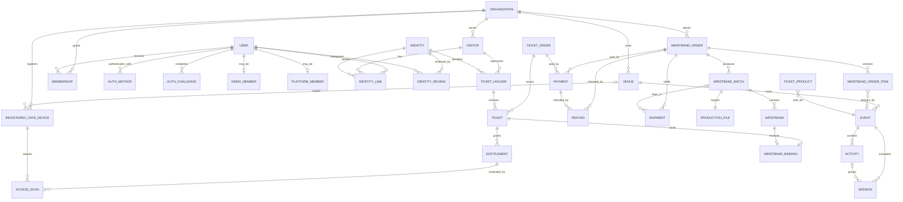

# KROWDS-DATA-001 — Data Model

## Metadata

| Field | Value |
| --- | --- |
| Document ID | `KROWDS-DATA-001` |
| System / module | KROWDS shared data platform |
| Version | `0.1` |
| Status | `Draft` |
| Release label | `0.1 Draft` |
| Owner | Data Platform Lead (TBD) |
| Data owner | Privacy and Data Governance Lead (TBD) |
| Last updated | `2026-09-24` |

## 1. Purpose and scope

This document defines the target persistent data model for KROWDS. PostgreSQL in one shared schema is the system of record for application data. Xendit, Biteship, Resend, and other providers remain external systems; their identifiers and verified event results are recorded, but their mutable business state is not copied as a second KROWDS source of truth.

### 1.1 In scope

- Platform identity and organization membership.
- The physical and scheduling hierarchy `Organization -> Venue -> Event -> optional Activity -> Session`.
- Visitor and ticket-holder records kept separate from platform users and legal identities.
- Ticketing, payment, entitlement, redemption, wristband stock, production, activation, binding, and access records.
- Wristband production CSV records, QR credentials, provider webhooks, domestic shipment records, and audit events.
- PostgreSQL tenant isolation, referential rules, lifecycle states, and data protection requirements.
- The online-first, IDR-only, single-use MVP policy: ticket transfer, re-entry, multi-use, and offline gate access are not represented.

### 1.2 Out of scope

- A `Branch` entity, table, field, or API resource. A venue is the physical location dimension in v0.1.
- Raw physical counts, artwork source files, and provider-owned label contents that are not represented by a KROWDS record or private object reference.
- Raw provider credentials and plaintext authentication secrets. Go-owned authentication stores only protected hashes, challenge digests, and provider references.
- Analytics copies, data-warehouse tables, and support-tool exports.
- International shipping, cash on delivery, marketplace courier selection, and offline gate decisions.
- Ticket transfer, re-entry, and multi-use or usage-count entitlements.
- Provider-side customer records and provider retention policies.

### 1.3 Decision status

- **Confirmed:** shared PostgreSQL schema, organization-scoped row-level security, UUIDv7 identifiers, UTC persistence, the location hierarchy, separated identity concepts, wristband stock and production lifecycles, opaque QR credentials, and the private CSV production record.
- **Target design:** the fields and constraints in this document describe the intended v0.1 implementation. A change after approval requires a migration and compatibility review.
- **Confirmed baseline:** retention durations follow the tiered schedule in `PRIVACY.md`; legal holds and statutory interpretation may extend them. The lifecycle rules below are mandatory.

## 2. Global data conventions

### 2.1 Tenant boundary and RLS

- `KROWDS-DATA-REQ-001` — KROWDS shall use one shared PostgreSQL schema, named `krowds`, for all application modules. Modules shall not create a second source-of-truth database per tenant.
- `KROWDS-DATA-REQ-002` — Every organization-owned table shall have a non-null `organization_id uuid` foreign key to `organizations.id`. Child foreign keys shall carry the same `organization_id` where practical, so a row cannot link to a resource from another organization.
- `KROWDS-DATA-REQ-003` — PostgreSQL row-level security (RLS) shall be enabled and forced on every organization-owned table. The normal policy shall require `organization_id` to equal the transaction-local organization context.
- `KROWDS-DATA-REQ-004` — The API layer shall set the organization context only after authenticating the actor and resolving an active `memberships` record. A client-supplied organization header or query value shall never be authoritative.
- `KROWDS-DATA-REQ-005` — KREW access may use a separately audited, time-bounded privileged path. Every cross-organization read or write shall record actor, purpose, request ID, and affected organization in the audit trail.
- `KROWDS-DATA-REQ-006` — Platform-global tables such as `users`, `identities`, `identity_reviews`, `auth_methods`, `auth_challenges`, `krew_members`, and `platform_members` shall be isolated by backend permissions and service policy. A global user is not implicitly a member of every organization.
- `KROWDS-DATA-REQ-020` — The MVP shall use Cloud SQL for PostgreSQL as the transactional system of record. Memorystore shall coordinate short-lived locks and idempotency; Cloud Storage shall hold private production files and legal documents; Secret Manager shall hold provider secrets; BigQuery shall receive redacted audit and reconciliation datasets.

The normal transaction context is represented by `SET LOCAL app.organization_id` and `SET LOCAL app.actor_id`. RLS policies use the organization context and never trust a value supplied directly by a browser. The `organizations` root uses its own `id` as the tenant selector; child tenant tables use `organization_id`. Database owners, migrations, and break-glass operations are separate operational roles and are not used by normal request handlers.

### 2.2 Identifiers and time

- `KROWDS-DATA-REQ-007` — Every KROWDS primary key and internal foreign key shall use a UUIDv7 value generated by the backend or a database function that preserves UUIDv7 ordering.
- `KROWDS-DATA-REQ-008` — API and CSV representations shall expose UUIDv7 values as canonical lowercase UUID strings. Public codes such as `wristband_code` are separate human-readable identifiers and are not substitutes for primary keys.
- `KROWDS-DATA-REQ-009` — Persisted instants shall use PostgreSQL `timestamptz` and shall be normalized to UTC. Responses shall use RFC 3339 with an explicit offset, normally `Z`.
- `KROWDS-DATA-REQ-010` — A venue, event, activity, or session may store an IANA time-zone name for display and scheduling. That name shall not change the UTC representation of persisted instants.
- `KROWDS-DATA-REQ-011` — A `date` may be used only for a local business date whose time zone is already explicit in the owning record; it shall not be used to represent an event instant.
- `KROWDS-DATA-REQ-021` — All MVP monetary values shall use Indonesian rupiah with `currency = 'IDR'`. A provider may retain its own currency metadata, but KROWDS shall not create a second supported currency in v0.1.

### 2.3 Common columns and mutation rules

All organization-owned tables include the following common columns:

| Column | Type | Rule |
| --- | --- | --- |
| `id` | `uuid` | UUIDv7 primary key |
| `organization_id` | `uuid` | Required tenant key and RLS discriminator |
| `created_at` | `timestamptz` | UTC creation instant, immutable |
| `updated_at` | `timestamptz` | UTC last-mutation instant |
| `created_by` | `uuid` | User or KREW actor; nullable for system work |
| `updated_by` | `uuid` | User or KREW actor; nullable for system work |
| `row_version` | `bigint` | Mon optimistic-concurrency version |

The system shall use restrictive foreign-key behavior for financial, production, binding, and audit records. A record is normally retired through its lifecycle status rather than hard deletion. Any exception requires a documented privacy workflow and an audit event.

## 3. Entity catalog

| ID | Entity / table | Purpose | Owner role | Tenant scope | Source of truth |
| --- | --- | --- | --- | --- | --- |
| `KROWDS-DATA-ENT-001` | `organizations` | Legal and operational organization tenant | Organization Product Owner (TBD) | Root | KROWDS PostgreSQL |
| `KROWDS-DATA-ENT-002` | `venues` | Physical location owned by an organization | Venue Operations Owner (TBD) | `organization_id` | KROWDS PostgreSQL |
| `KROWDS-DATA-ENT-003` | `events` | Scheduled event hosted at a venue | Event Product Owner (TBD) | `organization_id` | KROWDS PostgreSQL |
| `KROWDS-DATA-ENT-004` | `activities` | Optional event activity or program block | Event Product Owner (TBD) | `organization_id` | KROWDS PostgreSQL |
| `KROWDS-DATA-ENT-005` | `sessions` | Access or operating session for an event/activity | Event Product Owner (TBD) | `organization_id` | KROWDS PostgreSQL |
| `KROWDS-DATA-ENT-006` | `users` | Platform login and profile account | Identity Platform Owner (TBD) | Global | KROWDS PostgreSQL |
| `KROWDS-DATA-ENT-007` | `identities` | Legal identity evidence and verification status | Privacy and Data Governance Lead (TBD) | Global, protected | KROWDS PostgreSQL |
| `KROWDS-DATA-ENT-039` | `identity_reviews` | Manual KREW review workflow for consumer identity records | KREW Operations Lead (TBD) | Global, protected | KROWDS PostgreSQL |
| `KROWDS-DATA-ENT-034` | `auth_methods` | Protected password, Google OIDC, and verified account-authentication methods | Identity Platform Owner (TBD) | Global, protected | KROWDS PostgreSQL |
| `KROWDS-DATA-ENT-035` | `auth_challenges` | Short-lived hashed email OTP, recovery, and verification challenges | Identity Platform Owner (TBD) | Global, ephemeral | KROWDS PostgreSQL |
| `KROWDS-DATA-ENT-008` | `visitors` | Operational person record at a venue or event | Visitor Operations Owner (TBD) | `organization_id` | KROWDS PostgreSQL |
| `KROWDS-DATA-ENT-009` | `ticket_holders` | Person who receives a ticket and its entitlement | Ticketing Product Owner (TBD) | `organization_id` | KROWDS PostgreSQL |
| `KROWDS-DATA-ENT-010` | `memberships` | User-to-organization role and access grant | Organization Product Owner (TBD) | `organization_id` | KROWDS PostgreSQL |
| `KROWDS-DATA-ENT-011` | `krew_members` | Internal KROWDS operator account and operational role | KREW Operations Lead (TBD) | Global, privileged | KROWDS PostgreSQL |
| `KROWDS-DATA-ENT-038` | `platform_members` | Internal Platform Admin account and governance scope | Platform Operations Lead (TBD) | Global, privileged | KROWDS PostgreSQL |
| `KROWDS-DATA-ENT-012` | `onboarding_submissions` | Organization verification submission and review notes | Organization Product Owner (TBD) | `organization_id` | KROWDS PostgreSQL |
| `KROWDS-DATA-ENT-013` | `wristband_orders` | Organization wristband purchase and fulfillment order | Wristband Operations Owner (TBD) | `organization_id` | KROWDS PostgreSQL |
| `KROWDS-DATA-ENT-014` | `wristband_order_items` | Event/activity-linked design and quantity request | Wristband Operations Owner (TBD) | `organization_id` | KROWDS PostgreSQL |
| `KROWDS-DATA-ENT-015` | `wristband_batches` | Physical production and stock batch | Wristband Operations Owner (TBD) | `organization_id` | KROWDS PostgreSQL |
| `KROWDS-DATA-ENT-016` | `production_files` | Private CSV manifest for one wristband batch | Wristband Operations Owner (TBD) | `organization_id` | Private object storage referenced by KROWDS |
| `KROWDS-DATA-ENT-017` | `wristbands` | One physical wristband and its revocable credential | Wristband Operations Owner (TBD) | `organization_id` | KROWDS PostgreSQL |
| `KROWDS-DATA-ENT-018` | `wristband_stock_ledger` | Immutable single-use stock movement accounting | Wristband Operations Owner (TBD) | `organization_id` | KROWDS PostgreSQL |
| `KROWDS-DATA-ENT-019` | `batch_activations` | Batch activation-code verification and activation result | Wristband Operations Owner (TBD) | `organization_id` | KROWDS PostgreSQL |
| `KROWDS-DATA-ENT-033` | `shipments` | Domestic Biteship label, tracking, and delivery state for a wristband batch | Fulfillment Operations Owner (TBD) | `organization_id` | KROWDS PostgreSQL with Biteship references |
| `KROWDS-DATA-ENT-020` | `ticket_products` | Sellable ticket type and access rules | Ticketing Product Owner (TBD) | `organization_id` | KROWDS PostgreSQL |
| `KROWDS-DATA-ENT-021` | `ticket_orders` | Buyer checkout order | Commerce Product Owner (TBD) | `organization_id` | KROWDS PostgreSQL |
| `KROWDS-DATA-ENT-022` | `tickets` | Issued ticket for one ticket holder | Ticketing Product Owner (TBD) | `organization_id` | KROWDS PostgreSQL |
| `KROWDS-DATA-ENT-023` | `transactions` | Commercial transaction for ticket or wristband order | Commerce Product Owner (TBD) | `organization_id` | KROWDS PostgreSQL |
| `KROWDS-DATA-ENT-024` | `payments` | Provider payment attempt and verified payment result | Commerce Product Owner (TBD) | `organization_id` | KROWDS PostgreSQL |
| `KROWDS-DATA-ENT-036` | `refunds` | Full-order refund request, provider result, and reconciliation record | Finance Product Owner (TBD) | `organization_id` | KROWDS PostgreSQL with Xendit references |
| `KROWDS-DATA-ENT-025` | `entitlements` | Time- and scope-bound single-use access rights | Access Control Product Owner (TBD) | `organization_id` | KROWDS PostgreSQL |
| `KROWDS-DATA-ENT-026` | `ticket_redemptions` | Ticket verification and redemption record | Redemption Operations Owner (TBD) | `organization_id` | KROWDS PostgreSQL |
| `KROWDS-DATA-ENT-027` | `wristband_bindings` | Current relationship between a ticket, holder, identity, and wristband | Access Control Product Owner (TBD) | `organization_id` | KROWDS PostgreSQL |
| `KROWDS-DATA-ENT-028` | `access_scans` | Gate decision and reason for every access attempt | Access Control Product Owner (TBD) | `organization_id` | KROWDS PostgreSQL |
| `KROWDS-DATA-ENT-037` | `registered_gate_devices` | Organization-scoped device registration and lifecycle for online access | Access Control Product Owner (TBD) | `organization_id` | KROWDS PostgreSQL |
| `KROWDS-DATA-ENT-029` | `webhook_events` | Verified provider event inbox and processing result | Integration Platform Owner (TBD) | Provider/global with optional org link | KROWDS PostgreSQL |
| `KROWDS-DATA-ENT-030` | `audit_events` | Append-only record of sensitive actions | Security and Audit Owner (TBD) | Organization or global | KROWDS PostgreSQL |
| `KROWDS-DATA-ENT-031` | `invitations` | Organization membership invitation | Organization Product Owner (TBD) | `organization_id` | KROWDS PostgreSQL |
| `KROWDS-DATA-ENT-032` | `identity_links` | Explicit link between an identity and a user or visitor | Privacy and Data Governance Lead (TBD) | Contextual | KROWDS PostgreSQL |

## 4. Location and scheduling hierarchy

### 4.1 Organization — `KROWDS-DATA-ENT-001`

An organization is the tenant and legal operating party. It owns venues, schedules, commerce, staff, visitors, and wristband inventory.

| Field | Type | Required | Rules / meaning |
| --- | --- | --- | --- |
| `legal_name` | `text` | Yes | Legal name supplied during onboarding |
| `display_name` | `text` | Yes | Name shown in operator and attendee views |
| `organization_type` | `text` | Yes | Controlled organization type |
| `registration_number_ciphertext` | `bytea` | No | Encrypted legal registration value |
| `tax_id_ciphertext` | `bytea` | No | Encrypted tax identifier |
| `verification_status` | `text` | Yes | `draft`, `submitted`, `under_review`, `revision_required`, `approved`, `rejected`, `suspended`, or `closed` |
| `address` | `jsonb` | No | Structured postal address; sensitive values are access-controlled |
| `time_zone` | `text` | Yes | IANA default time zone for display |
| `approved_at` | `timestamptz` | No | Set only after KREW approval |
| `settings` | `jsonb` | Yes | Non-secret organization settings; defaults are explicit |

### 4.1a Onboarding submission — `KROWDS-DATA-ENT-012`

An onboarding submission records the required organization verification data and private object references used by the manual KREW review.

| Field | Type | Required | Rules / meaning |
| --- | --- | --- | --- |
| `legal_entity_name` | `text` | Yes | Legal entity name |
| `registration_reference_ciphertext` | `bytea` | Yes | Encrypted registration value |
| `representative_name_ciphertext` | `bytea` | Yes | Encrypted representative identity/contact reference |
| `tax_id_ciphertext` | `bytea` | Yes | Encrypted tax identifier |
| `business_address` | `jsonb` | Yes | Structured business address |
| `bank_verification_reference` | `text` | Yes | Safe reference to approved bank verification evidence |
| `authorized_signatory_reference` | `text` | Yes | Safe reference to authorized signatory declaration |
| `supporting_object_ids` | `uuid[]` | No | Private Cloud Storage objects; no public URLs |
| `review_status` | `text` | Yes | `draft`, `submitted`, `under_review`, `revision_required`, `approved`, `rejected` |
| `review_sla_due_at` | `timestamptz` | No | Set to the 2-business-day initial/revision target |
| `reviewer_id` | `uuid` | No | KREW reviewer |
| `review_reason_code` | `text` | No | Controlled non-PII decision/revision reason |

Required document and verification references must be present before `approved`; the target is a decision within 2 business days, not an automatic approval.

### 4.2 Venue — `KROWDS-DATA-ENT-002`

A venue is a physical location within an organization. Venue is the only location hierarchy entity between organization and event; there is no Branch layer.

| Field | Type | Required | Rules / meaning |
| --- | --- | --- | --- |
| `name` | `text` | Yes | Venue display name |
| `address` | `jsonb` | Yes | Physical address and optional directions |
| `time_zone` | `text` | Yes | IANA venue time zone |
| `status` | `text` | Yes | `active`, `inactive`, or `archived` |
| `access_instructions` | `text` | No | Operational information; never included in a QR payload |

### 4.3 Event — `KROWDS-DATA-ENT-003`

An event belongs to one venue and one organization. It owns optional activities and event-level sessions.

| Field | Type | Required | Rules / meaning |
| --- | --- | --- | --- |
| `venue_id` | `uuid` | Yes | Venue in the same organization |
| `name` | `text` | Yes | Event name |
| `description` | `text` | No | Public event information |
| `starts_at` | `timestamptz` | Yes | UTC instant |
| `ends_at` | `timestamptz` | Yes | UTC instant; must be after `starts_at` |
| `time_zone` | `text` | Yes | IANA display and scheduling zone |
| `capacity` | `integer` | No | Non-negative operational capacity |
| `status` | `text` | Yes | `draft`, `published`, `suspended`, `completed`, or `cancelled` |

### 4.4 Activity — `KROWDS-DATA-ENT-004`

An activity is an optional program block within an event. An event may have zero or more activities.

| Field | Type | Required | Rules / meaning |
| --- | --- | --- | --- |
| `event_id` | `uuid` | Yes | Parent event in the same organization |
| `name` | `text` | Yes | Activity name |
| `starts_at` | `timestamptz` | No | UTC instant |
| `ends_at` | `timestamptz` | No | UTC instant; must be after `starts_at` when both exist |
| `status` | `text` | Yes | `draft`, `active`, `cancelled`, or `completed` |

### 4.5 Session — `KROWDS-DATA-ENT-005`

A session is an access or operating window. It always belongs to an event. When an activity exists, `activity_id` identifies that activity; when no activity applies, `activity_id` is null and the session is event-level.

| Field | Type | Required | Rules / meaning |
| --- | --- | --- | --- |
| `event_id` | `uuid` | Yes | Parent event in the same organization |
| `activity_id` | `uuid` | No | Optional activity in the same event |
| `name` | `text` | Yes | Session name |
| `starts_at` | `timestamptz` | Yes | UTC instant |
| `ends_at` | `timestamptz` | Yes | UTC instant; must be after `starts_at` |
| `access_window` | `tstzrange` | No | Optional access interval; persisted in UTC |
| `status` | `text` | Yes | `scheduled`, `open`, `closed`, or `cancelled` |

A database constraint shall reject a session when `activity_id` points to an activity belonging to another event or organization.

## 5. Identity, organization access, and people

### 5.1 User — `KROWDS-DATA-ENT-006`

A user is a platform account. A user can browse and buy tickets, manage their own account, and hold organization or KREW roles. A user is not automatically a visitor, ticket holder, or organization member. One user may have multiple verified Identity records, while each ticket holder has one selected Identity for the ticket.

| Field | Type | Required | Rules / meaning |
| --- | --- | --- | --- |
| `primary_auth_method` | `text` | No | `password`, `google_oidc`, or `email_otp`; provider-specific references live in `auth_methods` |
| `email_ciphertext` | `bytea` | Yes | Encrypted login email |
| `email_normalized_hash` | `bytea` | Yes | Keyed or cryptographic lookup digest |
| `display_name` | `text` | No | Profile name; PII when associated with a person |
| `email_verified_at` | `timestamptz` | No | Set after verified email flow |
| `status` | `text` | Yes | `pending_verification`, `active`, `suspended`, or `closed` |
| `locale` | `text` | Yes | BCP 47 locale |

### 5.1a Authentication methods — `KROWDS-DATA-ENT-034`

Authentication methods are separate from the User profile so email/password and Google OIDC can coexist without storing a provider secret in the User record. Plaintext passwords, OTPs, access tokens, and provider credentials are never persisted.

| Field | Type | Required | Rules / meaning |
| --- | --- | --- | --- |
| `user_id` | `uuid` | Yes | Owning User |
| `method` | `text` | Yes | `password`, `google_oidc`, or another explicitly approved method |
| `provider_subject` | `text` | No | Stable provider subject for OIDC; unique within the provider when present |
| `secret_hash` | `bytea` | No | Adaptive password hash or protected verifier; never reversible |
| `verified_at` | `timestamptz` | No | Set after the method is verified |
| `status` | `text` | Yes | `pending`, `active`, `revoked`, or `compromised` |
| `last_used_at` | `timestamptz` | No | UTC instant of the last successful use |

A User may have multiple active methods. Account linking requires an explicit, audited rule; an email match alone never merges accounts.

### 5.1b Authentication challenges — `KROWDS-DATA-ENT-035`

Authentication challenges store only a digest, purpose, expiry, attempt count, and destination reference needed for verification. The readable OTP exists only in the bounded delivery and verification path.

| Field | Type | Required | Rules / meaning |
| --- | --- | --- | --- |
| `user_id` | `uuid` | No | User when the challenge is account-bound |
| `purpose` | `text` | Yes | `email_verification`, `login`, `recovery`, or another approved purpose |
| `destination_hash` | `bytea` | Yes | Protected lookup digest; no readable destination in ordinary logs |
| `challenge_hash` | `bytea` | Yes | One-way digest of the OTP or challenge value |
| `expires_at` | `timestamptz` | Yes | 15-minute OTP baseline; recovery links are 24 hours; access sessions are 15 minutes and refresh credentials are 30 days |
| `attempts` | `integer` | Yes | Non-negative failed-attempt count |
| `consumed_at` | `timestamptz` | No | Set after successful one-time use |
| `status` | `text` | Yes | `pending`, `consumed`, `expired`, `locked`, or `revoked` |

A successful challenge is consumed atomically. Expired, locked, superseded, and consumed challenges cannot be replayed. Resend and verification limits are enforced per account, destination, device, and network.

### 5.2 Identity — `KROWDS-DATA-ENT-007`

An identity is a separately governed legal-identity record. It may be linked to a user, visitor, or ticket holder through `identity_links` and a ticket-holder reference. Identity data is not merged into the user profile.

| Field | Type | Required | Rules / meaning |
| --- | --- | --- | --- |
| `identity_type` | `text` | Yes | Controlled identity-document type |
| `identity_number_ciphertext` | `bytea` | Yes | Encrypted identity number |
| `identity_number_hash` | `bytea` | Yes | Deduplication digest; never returned to a client |
| `issuing_country` | `text` | No | ISO country code |
| `verification_status` | `text` | Yes | `unverified`, `pending`, `verified`, `rejected`, or `expired` |
| `verified_at` | `timestamptz` | No | Verification instant |
| `expires_at` | `timestamptz` | No | Document expiry instant |
| `data_use_consent_at` | `timestamptz` | No | Consent record for the applicable purpose |

### 5.2a Consumer identity review — `KROWDS-DATA-ENT-039`

Consumer identity verification is a separate manual KREW workflow from organization onboarding. It does not accept consumer identity-document images and does not use automated OCR or liveness in the MVP.

| Field | Type | Required | Rules / meaning |
| --- | --- | --- | --- |
| `identity_id` | `uuid` | Yes | Identity record under review |
| `status` | `text` | Yes | `pending`, `in_review`, `revision_required`, `approved`, `rejected`, or `expired` |
| `requested_by` | `uuid` | No | User or system actor that created the review request |
| `reviewer_id` | `uuid` | No | Claimed KREW reviewer |
| `review_round` | `integer` | Yes | Starts at one and increments after a revision request |
| `claimed_at` | `timestamptz` | No | UTC time the reviewer claimed the case |
| `decided_at` | `timestamptz` | No | UTC decision time |
| `reason_code` | `text` | No | Controlled non-PII decision or revision reason |
| `review_notes_ciphertext` | `bytea` | No | Encrypted, access-restricted reviewer notes; excluded from normal responses and logs |
| `row_version` | `bigint` | Yes | Optimistic-concurrency version |

A review decision updates the linked `identities.verification_status` in the same guarded workflow. Initial review target is 1 business day and correction target is 2 business days. Approved, rejected, and expired decisions are retained for 24 months for audit and correction history.

### 5.3 Visitor — `KROWDS-DATA-ENT-008`

A visitor is an operational person record at an organization. It may be created from a ticket purchase, an on-site registration, or a gate scan and does not require a platform login.

| Field | Type | Required | Rules / meaning |
| --- | --- | --- | --- |
| `user_id` | `uuid` | No | Optional link to a registered user |
| `external_reference` | `text` | No | Organization-scoped non-PII reference |
| `display_name_ciphertext` | `bytea` | No | Encrypted visitor name |
| `status` | `text` | Yes | `registered`, `checked_in`, `departed`, `blocked`, or `erased` |
| `first_seen_at` | `timestamptz` | No | UTC first observed instant |
| `last_seen_at` | `timestamptz` | No | UTC last observed instant |

### 5.4 TicketHolder — `KROWDS-DATA-ENT-009`

An identity becomes `verified` only after the approved manual KREW review path, with identity type, number, and full legal name as the minimal fields. The MVP does not enable automated OCR, liveness, or consumer identity-document images. Matching correction wording and legal interpretation remain review items.

| Field | Type | Required | Rules / meaning |
| --- | --- | --- | --- |
| `visitor_id` | `uuid` | Yes | Visitor receiving the ticket |
| `identity_id` | `uuid` | Yes | Identity used for holder verification |
| `display_name_ciphertext` | `bytea` | No | Encrypted holder name snapshot for the purchase |
| `identity_snapshot_hash` | `bytea` | Yes | Hash used to detect material holder changes |
| `guardian_user_id` | `uuid` | No | Verified guardian account for a minor holder |
| `guardian_identity_id` | `uuid` | No | Verified guardian identity relationship for a minor holder |
| `source` | `text` | Yes | `online` or `cashier` |
| `guardian_consent_at` | `timestamptz` | No | Required before purchase or access for a minor; guardian relationship is verified |
| `status` | `text` | Yes | `pending_verification`, `verified`, `cancelled`, or `erased` |

The normalized `visitors` and `ticket_holders` records implement the product concept Visitor/TicketHolder without merging them into `users` or `identities`. Ticket-holder data is editable before successful payment and immutable afterward in the MVP. Ticket transfer is not represented. An Identity may hold at most five active tickets per Event, and at most one active ticket for the same Event, Ticket Product, and Session combination. Active means paid and not `Refunded`, `Cancelled`, `Expired`, or `Used`.

### 5.5 Membership — `KROWDS-DATA-ENT-010`

A membership grants one user a role in one organization. It is the authorization source for organization resources.

| Field | Type | Required | Rules / meaning |
| --- | --- | --- | --- |
| `user_id` | `uuid` | Yes | Platform user |
| `role` | `text` | Yes | Fixed MVP role: `organization_owner_admin`, `finance`, `ticketing`, `cashier`, `redemption`, `gate`, or `viewer` |
| `status` | `text` | Yes | `invited`, `active`, `suspended`, `revoked`, `declined`, or `expired` |
| `invited_by` | `uuid` | No | Inviting user or KREW system actor |
| `accepted_at` | `timestamptz` | No | Acceptance instant |
| `revoked_at` | `timestamptz` | No | Revocation instant |

### 5.6 KREW member — `KROWDS-DATA-ENT-011`

KREW is an internal KROWDS operator population, not an organization membership. A KREW member may operate across organizations only through an audited privileged permission.

| Field | Type | Required | Rules / meaning |
| --- | --- | --- | --- |
| `user_id` | `uuid` | Yes | Internal platform account |
| `krew_role` | `text` | Yes | `operations`, `production`, `quality_control`, `fulfillment`, `support`, or `admin` |
| `status` | `text` | Yes | `invited`, `active`, `suspended`, or `closed` |
| `verification_level` | `text` | Yes | Internal identity and training verification level |
| `employee_reference` | `text` | No | Internal non-customer reference |

KREW is one fixed internal role group. The `krew_role` values are capability labels inside that group and do not create additional Membership roles.

### 5.7 Platform Admin member — `KROWDS-DATA-ENT-038`

Platform Admin is a separate internal governance population. It is not an organization Membership and receives only audited, purpose-limited cross-organization permissions.

| Field | Type | Required | Rules / meaning |
| --- | --- | --- | --- |
| `user_id` | `uuid` | Yes | Internal platform account |
| `role` | `text` | Yes | Fixed MVP value `platform_admin` |
| `status` | `text` | Yes | `invited`, `active`, `suspended`, or `revoked` |
| `scope` | `text` | No | Approved support or governance scope; never a browser-selected tenant bypass |
| `approved_by` | `uuid` | Yes | Approving Platform authority |
| `approved_at` | `timestamptz` | Yes | UTC approval instant |
| `revoked_at` | `timestamptz` | No | UTC revocation instant |

Every Platform Admin action requires a named actor, purpose, request ID, and audit event. Platform Admin authority cannot set payment state, grant access, or bypass RLS.

## 6. Commerce and access records

### 6.1 Ticket product — `KROWDS-DATA-ENT-020`

A ticket product defines what an event, optional activity, or session grants. It is organization-owned and may be linked to the venue hierarchy.

| Field | Type | Required | Rules / meaning |
| --- | --- | --- | --- |
| `event_id` | `uuid` | Yes | Event in the same organization |
| `activity_id` | `uuid` | No | Optional activity in the same event |
| `session_id` | `uuid` | No | Optional session in the same event |
| `name` | `text` | Yes | Product name |
| `description` | `text` | No | Public product description |
| `price_amount` | `numeric(20,0)` | Yes | Non-negative integer IDR amount |
| `tax_inclusive` | `boolean` | Yes | `true` for the MVP catalog; customer invoice wording and detailed tax treatment remain subject to Finance/Legal |
| `currency` | `text` | Yes | Always `IDR` in the MVP |
| `inventory_limit` | `integer` | No | Non-negative limit; null means unbounded by product |
| `status` | `text` | Yes | `draft`, `on_sale`, `paused`, or `sold_out` |

### 6.2 Ticket order — `KROWDS-DATA-ENT-021`

A ticket order is the buyer’s checkout. It does not represent a wristband stock order.

| Field | Type | Required | Rules / meaning |
| --- | --- | --- | --- |
| `buyer_user_id` | `uuid` | No | Buyer account; cashier orders may have no user |
| `status` | `text` | Yes | `created`, `pending_payment`, `paid`, `failed`, `cancelled`, or `refunded`; ticket issuance is represented by `tickets`, not an order state |
| `currency` | `text` | Yes | Always `IDR` in the MVP |
| `subtotal_amount` | `numeric(20,0)` | Yes | Non-negative integer IDR amount |
| `total_amount` | `numeric(20,0)` | Yes | Non-negative integer IDR amount |
| `payment_id` | `uuid` | No | Current payment record |
| `idempotency_key` | `text` | Yes | Client checkout key, unique within actor and endpoint |
| `placed_at` | `timestamptz` | No | UTC checkout instant |

### 6.3 Ticket — `KROWDS-DATA-ENT-022`

A ticket is the issued credential for one ticket holder and one verified identity. Its QR code is opaque and contains no personal data. The normal API never returns the wristband credential token; the same principle applies to ticket credentials. The MVP permits one successful access only, does not support transfer, and does not support re-entry.

| Field | Type | Required | Rules / meaning |
| --- | --- | --- | --- |
| `ticket_order_id` | `uuid` | Yes | Parent ticket order |
| `ticket_product_id` | `uuid` | Yes | Purchased product |
| `ticket_holder_id` | `uuid` | Yes | One holder and one identity for the ticket |
| `status` | `text` | Yes | `pending_payment`, `issued`, `reserved`, `bound`, `used`, `expired`, `cancelled`, `refunded`, or `revoked` |
| `qr_token_hash` | `bytea` | No | SHA-256 digest of an opaque ticket token; never plaintext |
| `issued_at` | `timestamptz` | No | UTC issue instant |
| `bound_at` | `timestamptz` | No | UTC binding instant |
| `expires_at` | `timestamptz` | No | UTC expiry instant |

### 6.4 Transaction and payment — `KROWDS-DATA-ENT-023`, `KROWDS-DATA-ENT-024`

Transactions record commercial intent and totals. Payments record a provider attempt and a verified provider result. A digital payment becomes paid only after a verified Xendit webhook or an equivalent approved provider confirmation; a staff button cannot mark it paid by itself.

| Record | Important fields | Invariant |
| --- | --- | --- |
| `transactions` | `order_type`, `order_id`, `status`, `amount`, `currency`, `provider_reference` | Amount and status are immutable after settlement, except for an auditable full-refund transition; `currency` is `IDR` |
| `payments` | `transaction_id`, `provider`, `method`, `provider_payment_id`, `status`, `expires_at`, `paid_at`, `webhook_event_id` | `method` is `qris`, `virtual_account`, or approved Xendit e-wallet; instruction expires after 30m online or 15m cashier; one provider payment ID is unique per provider; only a verified Xendit event may transition to `paid`; MVP refund is full, occurs before use/binding, and is either in-window or dual-approved through `exceptional_review` |

Supported payment channels in v0.1 are QRIS, Virtual Account, and approved Xendit e-wallet methods only; cashier sales use QRIS. Cards and other payment methods are not exposed in v0.1. Payment records use the canonical status set `created`, `pending`, `authorized`, `paid`, `failed`, `expired`, or `refunded`; provider names and internal states are normalized so a provider change does not alter ticket semantics.

### 6.5 Refund — `KROWDS-DATA-ENT-036`

A refund is a full-order financial workflow. Requests are accepted before Bound/Used and within 7 calendar days after verified payment; later requests enter `exceptional_review` and require a dual-approved Finance decision before provider submission. Partial refunds are not represented in the MVP.

| Field | Type | Required | Rules / meaning |
| --- | --- | --- | --- |
| `transaction_id` | `uuid` | Yes | Original paid transaction |
| `provider_refund_id` | `text` | No | Xendit refund reference after provider acceptance |
| `status` | `text` | Yes | `requested`, `exceptional_review`, `processing`, `succeeded`, `failed`, `cancelled`, or `rejected` |
| `amount` | `numeric(20,0)` | Yes | Must equal the full eligible order amount |
| `reason_code` | `text` | Yes | Controlled non-PII reason |
| `requested_by` | `uuid` | Yes | Authorized User or organization actor |
| `requested_at` | `timestamptz` | Yes | UTC request instant |
| `row_version` | `bigint` | Yes | Optimistic-concurrency version for review and approval transitions |
| `completed_at` | `timestamptz` | No | UTC provider-confirmed completion instant |

A refund is idempotent by transaction and operation key. It is rejected when any ticket is `bound` or `used`, and the provider-confirmed result controls the payment projection.

### 6.6 Entitlement — `KROWDS-DATA-ENT-025`

An entitlement is the access rule derived from a valid ticket. It is separate from the physical wristband and is evaluated at access time. In v0.1 it is single-use: no usage-count entitlement, re-entry, or offline authorization is stored.

| Field | Type | Required | Rules / meaning |
| --- | --- | --- | --- |
| `ticket_id` | `uuid` | Yes | Source ticket |
| `event_id` | `uuid` | Yes | Event scope |
| `activity_id` | `uuid` | No | Optional activity scope |
| `session_id` | `uuid` | No | Optional session scope |
| `valid_from` | `timestamptz` | No | UTC start of validity |
| `valid_until` | `timestamptz` | No | UTC end of validity |
| `access_policy` | `text` | Yes | Fixed MVP value `single_use`; re-entry and multi-use are not supported |
| `use_state` | `text` | Yes | `unused` or `consumed`; the first successful access changes it atomically |
| `status` | `text` | Yes | `pending`, `active`, `consumed`, `expired`, or `revoked` |

### 6.7 Redemption, binding, and access — `KROWDS-DATA-ENT-026` through `KROWDS-DATA-ENT-028`

- `ticket_redemptions` records staff scan time, venue, ticket result, and the request ID. A successful redemption is linked to one wristband.
- `wristband_bindings` records `Identity -> Ticket -> Wristband` and the event/activity/session entitlement scope. It is append-aware: a replacement or release is a new audited transition, not an untracked overwrite.
- `access_scans` records every attempt as `access_granted`, `access_denied`, or `access_error`, with a reason code, venue, scanner actor, timestamp, and request ID. A denial is a valid audit outcome, not a missing record.

### 6.8 Registered gate device — `KROWDS-DATA-ENT-037`

A registered gate device is an organizational operational resource. Registration establishes identity and scope; it does not grant access by itself.

| Field | Type | Required | Rules / meaning |
| --- | --- | --- | --- |
| `device_reference` | `text` | Yes | Stable non-secret device label, unique within the organization |
| `venue_id` | `uuid` | No | Venue where the device may operate; must belong to the organization |
| `fingerprint_hash` | `bytea` | No | Protected device/install fingerprint digest; never a raw browser claim |
| `status` | `text` | Yes | `pending_registration`, `active`, `suspended`, `disabled`, or `revoked` |
| `registered_by` | `uuid` | Yes | Organization Owner/Admin actor |
| `registered_at` | `timestamptz` | Yes | UTC registration instant |
| `last_seen_at` | `timestamptz` | No | UTC last authenticated device heartbeat or scan |
| `revoked_at` | `timestamptz` | No | UTC revocation instant |

Only an active device in the expected organization and venue scope may submit an access scan. Device lifecycle changes are audited and use optimistic concurrency.

## 7. Wristband stock, production, and credential data

### 7.1 Wristband order — `KROWDS-DATA-ENT-013`

A wristband order is the organization’s purchase and fulfillment request. It can contain items for different events, activities, designs, or sessions, but it is always scoped to one organization and contains no Branch reference.

| Field | Type | Required | Rules / meaning |
| --- | --- | --- | --- |
| `order_number` | `text` | Yes | Human-readable organization order number, unique in organization |
| `status` | `text` | Yes | `draft`, `submitted`, `payment_pending`, `paid`, `verification_pending`, `revision_required`, `approved`, `production`, `quality_control`, `quarantined`, `shipped`, `delivered`, `completed`, `cancelled`, or `payment_failed` |
| `currency` | `text` | Yes | Always `IDR` in the MVP |
| `total_amount` | `numeric(20,0)` | Yes | Non-negative integer IDR amount |
| `billing_address_ciphertext` | `bytea` | No | Encrypted billing address |
| `shipping_address_ciphertext` | `bytea` | No | Encrypted shipping address |
| `shipping_cost_amount` | `numeric(20,0)` | No | Integer IDR live Biteship quote when known; charged to organization |
| `shipping_payer` | `text` | Yes | Always `organization` for the MVP; COD is not represented |
| `shipping_method` | `text` | No | Organization-selected service from approved domestic Biteship allowlist; customer does not select courier |
| `submitted_at` | `timestamptz` | No | UTC submission instant |
| `paid_at` | `timestamptz` | No | UTC verified payment instant |

### 7.2 Wristband order item — `KROWDS-DATA-ENT-014`

| Field | Type | Required | Rules / meaning |
| --- | --- | --- | --- |
| `wristband_order_id` | `uuid` | Yes | Parent order |
| `event_id` | `uuid` | No | Event-specific design or quantity |
| `activity_id` | `uuid` | No | Optional activity-specific design or quantity |
| `session_id` | `uuid` | No | Optional session-specific design or quantity; must belong to the same event and activity scope |
| `design_key` | `text` | Yes | Approved artwork/design reference |
| `material` | `text` | Yes | Production material |
| `quantity` | `integer` | Yes | Positive requested quantity |
| `unit_price_amount` | `numeric(20,0)` | Yes | Non-negative integer IDR amount |

The system shall validate that every event, activity, and session reference belongs to the same organization and consistent hierarchy as the order.

### 7.3 Shipment — `KROWDS-DATA-ENT-033`

A shipment represents domestic fulfillment of one or more wristband batches. Biteship owns label and tracking state; KROWDS stores the verified provider reference and its own fulfillment projection.

| Field | Type | Required | Rules / meaning |
| --- | --- | --- | --- |
| `wristband_order_id` | `uuid` | Yes | Parent wristband order |
| `wristband_batch_id` | `uuid` | No | Batch when the shipment has one batch |
| `provider` | `text` | Yes | `biteship` for v0.1 |
| `provider_shipment_id` | `text` | No | Biteship shipment identifier |
| `tracking_number` | `text` | No | Current domestic tracking number |
| `label_storage_key` | `text` | No | Private Cloud Storage reference for the label |
| `status` | `text` | Yes | `pending`, `label_created`, `picked_up`, `in_transit`, `delivered`, `failed`, `cancelled`, or `reshipment_pending` |
| `shipped_at` | `timestamptz` | No | UTC carrier handoff instant |
| `delivered_at` | `timestamptz` | No | UTC verified delivery instant |
| `reshipment_of_shipment_id` | `uuid` | No | Original shipment when this is a replacement attempt; same-organization relationship |
| `failure_code` | `text` | No | Controlled non-PII provider or operations code |

Shipment state changes are accepted only from verified Biteship webhooks or an explicitly authorized KREW fulfillment correction. KROWDS does not store cash-on-delivery, international, or marketplace courier options in the MVP.

### 7.4 Wristband batch — `KROWDS-DATA-ENT-015`

A batch is the stock and production unit that receives one private production file and one activation operation. A batch enters `shipped` only after verified carrier handoff; passing QC alone leaves it in `quality_control`. A batch may enter `activation_pending` only when `delivery_evidence_reference` is verified and `organization_receipt_confirmed_at`, `organization_receipt_confirmed_by`, `organization_receipt_package_count`, and `organization_receipt_evidence_reference` are recorded; the activation transaction must enforce all conditions.

| Field | Type | Required | Rules / meaning |
| --- | --- | --- | --- |
| `wristband_order_id` | `uuid` | Yes | Parent order |
| `batch_code` | `text` | Yes | Human-readable batch code, unique in organization |
| `status` | `text` | Yes | `created`, `production`, `quality_control`, `shipped`, `delivered`, `activation_pending`, `activated`, `quarantined`, `revoked`, or `void` |
| `quantity` | `integer` | Yes | Positive number of physical units |
| `schema_version` | `text` | Yes | Production CSV schema version |
| `activation_code_hash` | `bytea` | No | Hash only; plaintext is delivered through the authenticated dashboard and Resend activation message |
| `delivery_evidence_reference` | `text` | No | Verified Biteship event or authorized fulfillment evidence reference; required before `delivered` |
| `delivery_evidence_verified_at` | `timestamptz` | No | UTC instant when provider delivery evidence was verified |
| `organization_receipt_confirmed_at` | `timestamptz` | No | UTC instant when the organization authenticated receipt and package count |
| `organization_receipt_confirmed_by` | `uuid` | No | Authorized organization actor who confirmed receipt |
| `organization_receipt_package_count` | `integer` | No | Physical package count confirmed by the organization |
| `organization_receipt_evidence_reference` | `text` | No | Audit or private evidence reference for the receipt confirmation |
| `activated_at` | `timestamptz` | No | UTC activation instant |
| `activated_by` | `uuid` | No | Authorized organization actor |

### 7.4a Canonical lifecycle mapping

The order, batch, and individual-unit machines are separate. Human labels must not be confused with database enums:

| Machine | Canonical enum values | Human/API interpretation |
| --- | --- | --- |
| `wristband_orders.status` | `draft`, `submitted`, `payment_pending`, `paid`, `verification_pending`, `revision_required`, `approved`, `production`, `quality_control`, `quarantined`, `shipped`, `delivered`, `completed`, `cancelled`, `payment_failed` | `completed` means the order workflow is complete after batch activation; it is not the batch state |
| `wristband_batches.status` | `created`, `production`, `quality_control`, `shipped`, `delivered`, `activation_pending`, `activated`, `quarantined`, `revoked`, `void` | `activated` is the raw enum for the human label `Batch Activated` |
| `wristbands.status` (stock) | `available`, `reserved`, `bound`, `active`, `used`, `expired`, `disabled`, `quarantined`, `revoked` | Stock is immediately allocatable at `available` |
| `wristbands.status` (produced) | `generated`, `production`, `quality_control`, `shipped`, `delivered`, `quarantined`, `available`, `reserved`, `bound`, `active`, `used`, `expired`, `disabled`, `revoked` | `available` is reached only after the parent batch is `activated` |

The API returns raw enum values; the UI may display `Batch Activated` for `wristband_batches.status=activated`. A batch activation command accepts only `activation_pending` and atomically moves eligible units to `available`. The ticket order `failed` value is the durable projection of a payment failure or expiry; it is not a second payment authority.

### 7.5 Private production file - `KROWDS-DATA-ENT-016`

`KROWDS-DATA-REQ-012` — The production CSV header shall be exactly:

```text
batch_id,wristband_code,qr_payload,schema_version
```

Each row represents one wristband. `batch_id` is the UUIDv7 batch identifier, `wristband_code` is the human-readable printed identifier, `qr_payload` is the encoded opaque credential, and `schema_version` identifies the row interpretation.

- `KROWDS-DATA-REQ-013` — The CSV shall be stored in private object storage, encrypted at rest, with access limited to authorized KREW and fulfillment operators. A download shall use a short-lived signed URL and shall be recorded in the audit trail.
- `KROWDS-DATA-REQ-014` — The CSV shall contain no name, identity number, ticket, payment, entitlement, access, customer, or other PII.
- `KROWDS-DATA-REQ-015` — The plaintext `qr_payload` may exist in the private production file and transient generation memory only. It shall not be written to PostgreSQL, application logs, analytics events, or normal API responses.

### 7.6 Wristband - `KROWDS-DATA-ENT-017`

| Field | Type | Required | Rules / meaning |
| --- | --- | --- | --- |
| `wristband_batch_id` | `uuid` | No | Parent batch for newly produced units; null for pre-existing stock |
| `inventory_source` | `text` | Yes | `stock` or `produced` |
| `wristband_code` | `text` | Yes | Plain-text human-readable identifier; format is controlled by `KROWDS-OD-028`; unique within the organization; no global uniqueness requirement; the QR token remains globally unique |
| `qr_token_hash` | `bytea` | Yes | SHA-256 digest of the 128-bit opaque token; unique |
| `qr_token_version` | `integer` | Yes | Starts at one and increments on credential replacement |
| `status` | `text` | Yes | `generated`, `production`, `quality_control`, `shipped`, `delivered`, `quarantined`, `available`, `reserved`, `bound`, `active`, `used`, `expired`, `disabled`, or `revoked` |
| `activated_at` | `timestamptz` | No | UTC batch activation instant |
| `bound_at` | `timestamptz` | No | UTC binding instant |
| `expires_at` | `timestamptz` | No | UTC expiry instant |
| `revoked_at` | `timestamptz` | No | UTC credential revocation instant |
| `revocation_reason` | `text` | No | Controlled non-PII reason code |

`KROWDS-DATA-REQ-016` — The QR credential shall use 16 cryptographically random bytes (128 bits) of opaque token material, satisfying the MVP minimum of at least 128 bits of entropy. The QR payload is the unpadded base64url encoding of that token; it shall be status-bound, revocable, PII-free, and shall not encode an ID, status, organization, event, ticket, identity, or other predictable data.
`KROWDS-DATA-REQ-017` — KROWDS shall store the QR token hashed at rest using the approved SHA-256 baseline and shall not store its plaintext in PostgreSQL.
`KROWDS-DATA-REQ-018` — Every QR validation shall check the current wristband status, batch activation, binding, single-use entitlement, expiry, and revocation state. A token may be resolved for an authorized redemption workflow, but it is access-valid only while the unit is `active` and its entitlement is valid; a valid token by itself shall never grant access.
`KROWDS-DATA-REQ-019` — A wristband and its QR token shall be revocable. Revocation shall be auditable, immediately effective, and followed by issuance of a new token and version if replacement is approved.

### 7.7 Stock ledger and activation - `KROWDS-DATA-ENT-018`, `KROWDS-DATA-ENT-019`

`wristband_stock_ledger` is append-only. Each row has `movement_type` (`reserve`, `release`, `receive`, `bind`, `activate`, `use`, `expire`, `disable`, `quarantine`, `revoke`, or `write_off`), a signed `quantity_delta`, an optional `wristband_id`, a business reference, an actor, `occurred_at`, and an idempotency key. The current stock balance is calculated from the ledger and reconciled by KROWDS Operations. A stock unit follows the single-use path `available -> reserved -> bound -> active -> used / expired / disabled / revoked`; the ledger does not represent re-entry or multi-use inventory.

`batch_activations` stores the batch activation attempt, activation-code hash, status (`pending`, `verified`, `rejected`, or `completed`), actor, timestamp, and request ID. A successful activation moves every eligible wristband in the batch from `delivered` to `available` in one auditable operation.

Existing stock and newly produced units share the same unit-level access states after availability. Existing stock starts at `available`; a cashier or online checkout reserves it before payment. Newly produced units cannot become `available` until delivery and batch activation.

## 8. Provider, audit, and relationship records

### 8.1 Verified webhook inbox — `KROWDS-DATA-ENT-029`

`webhook_events` stores `provider` (`xendit`, `biteship`, or `resend`), `provider_event_id`, raw-body hash, signature-verification result, optional `organization_id`, received/processed timestamps, processing status, and a redacted error code. The raw body may be retained only in a restricted, time-limited integration inbox and shall not contain credentials or secrets in logs.

The provider event ID is unique within the provider. A verified duplicate is acknowledged without repeating the business mutation. Signature failure is rejected before the event enters the processing queue.

### 8.2 Audit event — `KROWDS-DATA-ENT-030`

`audit_events` is append-only and includes `organization_id` when applicable, actor type and ID, action, resource type and ID, request ID, UTC timestamp, outcome, and redacted metadata. It shall record onboarding decisions, role changes, payments, refunds, production-file access, batch activation, credential revocation, binding, access decisions, and privileged KREW access.

Audit metadata shall exclude plaintext QR tokens, passwords, access tokens, payment secrets, full identity numbers, and unnecessary visitor PII.

### 8.3 Invitations and identity links — `KROWDS-DATA-ENT-031`, `KROWDS-DATA-ENT-032`

`invitations` stores a hashed invitation token, organization, role, invited user or normalized email digest, expiry, status, inviter, and accepter. `identity_links` stores explicit references between an identity and a user or visitor, verification source, and link status. These records prevent an organization role from being inferred from an identity document alone.

## 9. Relationship map



The diagram intentionally has no `BRANCH` entity. `Venue` replaces any former branch or location abstraction.

### 9.1 Relationship rules

| From | Relationship | To | Cardinality | Rule |
| --- | --- | --- | --- | --- |
| `organizations` | owns | `venues` | 1:N | Venue must have the same `organization_id` |
| `venues` | hosts | `events` | 1:N | Event must reference one venue in the same organization |
| `organizations` | registers | `registered_gate_devices` | 1:N | Device registration is organization-scoped and audited |
| `venues` | scopes | `registered_gate_devices` | 1:N | A device may be restricted to one venue; venue must belong to the same organization |
| `events` | contains | `activities` | 1:0..N | Activity is optional |
| `events` | schedules | `sessions` | 1:0..N | Event-level session has null `activity_id` |
| `activities` | groups | `sessions` | 1:0..N | Activity and session event IDs must match |
| `users` | receives | `memberships` | 1:N | Unique active membership per organization and user |
| `users` | uses | `auth_methods` | 1:N | Multiple approved authentication methods may exist; no plaintext secret is stored |
| `users` | completes | `auth_challenges` | 1:N | Challenges are short-lived, hashed, rate-limited, and one-time |
| `users` | may be | `platform_members` | 1:0..1 | Platform Admin is separate from organization Membership and is audited |
| `users` | may be | `krew_members` | 1:0..1 | KREW is separate from organization membership |
| `visitors` | has | `identities` | N:M | Links are explicit and auditable |
| `identities` | has | `identity_reviews` | 1:N | Manual KREW review history is retained; current verification status is protected |
| `ticket_holders` | identifies through | `identities` | N:1 | A holder must have a verified identity before ticket issue |
| `wristband_batches` | contains | `wristbands` | 1:N | Batch quantity must reconcile to unit rows |
| `wristband_orders` | fulfills | `shipments` | 1:N | Biteship owns carrier state; KROWDS stores verified projection |
| `wristband_orders` | paid by | `payments` | 1:N | Xendit-backed payment references are retained; payment state is not manually set |
| `wristband_orders` | refunded by | `refunds` | 1:N | MVP supports a full-order refund trajectory only |
| `tickets` | binds | `wristbands` | N:0..1 active | One active binding per wristband and per ticket |
| `payments` | has | `refunds` | 1:N | MVP supports one full-order refund trajectory; duplicate provider events are idempotent |
| `entitlements` | authorizes | `access_scans` | 1:N | Access checks current state at scan time |
| `registered_gate_devices` | submits | `access_scans` | 1:N | Only an active device in the expected scope may submit a scan |
| `organizations` | scopes | all operational records | 1:N | RLS and composite foreign keys enforce isolation |

## 10. Constraints and indexes

| ID | Constraint or index | Reason |
| --- | --- | --- |
| `KROWDS-DATA-CON-001` | Primary keys and foreign keys use UUIDv7 | Stable, non-sequential, time-sortable references |
| `KROWDS-DATA-CON-002` | Unique `(organization_id, user_id)` for active memberships | One effective organization role per user |
| `KROWDS-DATA-CON-003` | Unique `(organization_id, order_number)` for wristband orders | Human lookup without cross-tenant collision |
| `KROWDS-DATA-CON-004` | Unique `(organization_id, wristband_code)` and unique `qr_token_hash` | Fast tenant-scoped physical lookup and collision resistance |
| `KROWDS-DATA-CON-005` | Unique `(provider, provider_event_id)` for webhook events | One business effect under at-least-once delivery |
| `KROWDS-DATA-CON-006` | Partial unique active binding on `wristband_id` and `ticket_id` | Prevents a credential or ticket from being reused concurrently |
| `KROWDS-DATA-CON-007` | Enforce `activity_id` event consistency for sessions, products, and bindings with composite foreign keys, a constraint trigger, or an equivalent transactional database mechanism—not a row-level `CHECK` alone | Prevents cross-event access scope |
| `KROWDS-DATA-CON-008` | Unique stock-ledger idempotency reference and one active `reserved` unit per checkout | Prevents double reservation, allocation, or use |
| `KROWDS-DATA-CON-009` | Index every `organization_id` plus common filter/sort columns | RLS-filtered list and cursor queries remain usable |
| `KROWDS-DATA-CON-010` | Index `wristbands(status, organization_id)`, `qr_token_hash`, and `wristband_code` | Activation, revocation, and operational lookup |
| `KROWDS-DATA-CON-011` | Index `events(organization_id, venue_id, starts_at)` and `sessions(organization_id, event_id, starts_at)` | Schedule and access-window queries |
| `KROWDS-DATA-CON-012` | Index `access_scans(organization_id, venue_id, scanned_at)` and `audit_events(organization_id, occurred_at)` | Audit investigation and operational reporting |
| `KROWDS-DATA-CON-013` | Restrict deletion of referenced organizations, events, batches, tickets, and audit records | Preserve operational history |
| `KROWDS-DATA-CON-014` | Encrypt or hash identity and credential lookup values; never expose lookup digests | Minimize PII and secret leakage |
| `KROWDS-DATA-CON-015` | Transactional order-line and ticket guard: `currency = 'IDR'`, `access_policy = 'single_use'`, maximum 10 tickets per order, maximum five active tickets per verified Identity per Event within an organization, and one active ticket per Organization/Identity/Event/Ticket Product/Session combination. Enforce aggregate and cross-row rules with a transaction plus partial unique index, constraint trigger, or equivalent database mechanism—not a row-level `CHECK` alone. | Enforce MVP commercial and access policy |
| `KROWDS-DATA-CON-016` | Unique `(provider, provider_shipment_id)` for non-null Biteship shipment references | Prevents duplicate delivery projection |
| `KROWDS-DATA-CON-017` | Transactional batch-activation guard requiring verified delivery evidence plus organization receipt actor, timestamp, package count, and evidence reference | Prevents receipt-only or provider-only activation |
| `KROWDS-DATA-CON-018` | Canonical active-ticket key is maintained transactionally from Organization, Identity, Event, Ticket Product, and Session; enforce one active row with a partial unique index or equivalent constraint | Prevents duplicate active holder scope without relying on a row-level `CHECK` |

## 11. Data lifecycle and retention

| Record group | Create | Active | Archive or revoke | Deletion / erasure |
| --- | --- | --- | --- | --- |
| Organization and identity | Create after authenticated registration or onboarding | Update through approved use cases | `suspended`, `closed`, or `expired` according to its state machine | Account/profile and identity-review evidence: 24 months after closure; organization legal/banking records: 7 years; preserve required audit references |
| User and membership | Create through registration or invitation | `active` membership grants scoped access | `suspended`, `revoked`, `declined`, or `expired` | Delete or anonymize account data after 24 months, policy, and legal-hold checks |
| Registered gate device | Register through an audited organization command | `active` device may submit scans in its approved scope | `suspended`, `disabled`, or `revoked` | Retain device reference and audit evidence for 24 months; delete only under approved policy |
| Venue, event, activity, session | Create in `draft` | Publish, schedule, open, and complete | `cancelled`, `completed`, or `archived` | Retain event records needed for ticketing and audit; no Branch cleanup exists |
| Visitor and ticket holder | Create at purchase, registration, or check-in | Update only through operational workflows | `departed`, `blocked`, `cancelled`, or `erased` | Apply privacy erasure request; retain non-identifying financial and audit links for 7 years where required |
| Wristband order and batch | Create in `draft` or `created` | Production, QC, shipping, delivery, and activation | `cancelled`, `quarantined`, `void`, `revoked`, or `completed` | Retain production and credential history for 24 months after lifecycle closure; never hard-delete required audit history |
| Shipment | Create after KREW fulfillment preparation | Label, pickup, transit, and verified delivery | `failed`, `cancelled`, or `reshipment_pending` | Retain provider reference and tracking audit for 12 months after reconciliation; delete label object under policy |
| Wristband and QR credential | Generate token and hash at unit creation | Available, reserved, bound, and active states | `used`, `expired`, `disabled`, or `revoked` | Disable credential immediately; retain status and hash for 24 months for replay investigation; never recover plaintext token |
| Private production CSV | Generate after KREW verification | Retain only for production and fulfillment | Expire 30 days after batch activation; reconciliation must complete before deletion but does not extend the timer absent legal hold | Delete the private object and local copies; retain metadata and hash |
| Payment, transaction, access, and audit | Create through application or verified provider flow | Reconcile and investigate | `refunded`, `consumed`, `expired`, or immutable archive | Finance/transaction records: 7 years; access/audit records: 24 months; follow legal holds |
| Analytics and operational telemetry | Create from approved aggregate or pseudonymous events and redacted service signals | Monitor reliability, capacity, and approved operations | Dataset expiration, access restriction, or deletion | Event-level analytics: 30 days; operational logs/metrics/traces: 30/90/365 days by environment; follow legal holds |

These tiered durations are the MVP baseline. Privacy and Legal Counsel may require longer retention for a legal hold, statutory record, or documented dispute. No lifecycle transition may bypass an active legal hold.

## 12. Privacy and security controls

- `KROWDS-DATA-SEC-001` — Encrypt identity numbers, names, addresses, payment references, and other restricted fields at rest and in transit. Store only the minimum lookup digest needed for deduplication.
- `KROWDS-DATA-SEC-002` — Keep QR payloads opaque and PII-free. The payload shall not contain a name, identity number, ticket number, payment information, entitlement, event details, organization details, or venue details.
- `KROWDS-DATA-SEC-003` — Store the 128-bit QR token hash at rest. A plaintext token may be printed or placed in the private production CSV, but shall not be logged, returned by a normal API, or retained in application memory after the operation that requires it.
- `KROWDS-DATA-SEC-004` — Revoke a credential by updating its authoritative status and writing an audit event. A token scan must fail immediately after revocation, even if the physical QR image has not changed.
- `KROWDS-DATA-SEC-005` — Apply organization RLS to reads and writes, including list endpoints, exports, background jobs, and support tools.
- `KROWDS-DATA-SEC-006` — Store webhook signatures and provider secrets in a secret manager, not in this schema or in documentation.
- `KROWDS-DATA-SEC-007` — Redact request bodies, QR payloads, identity numbers, access tokens, and payment secrets from structured logs. Keep the request ID and non-sensitive resource IDs for correlation.
- `KROWDS-DATA-SEC-008` — Require a role permission and an auditable reason for staff actions involving payment, refund, binding, revocation, batch activation, identity verification, or cross-organization support.
- `KROWDS-DATA-SEC-009` — The MVP shall store only single-use entitlement state. It shall not create a re-entry, multi-use, usage-count, or offline authorization record.
- `KROWDS-DATA-SEC-010` — Provider webhooks and asynchronous work use authenticated, idempotent, replay-resistant processing. KROWDS shall not trust a client-side payment, shipment, or email state without a verified provider event or an authorized audited correction.
- `KROWDS-DATA-SEC-011` — KROWDS shall not store raw card data. Xendit payment data remains tokenized at the provider boundary; only provider references and safe payment metadata belong in KROWDS.
- `KROWDS-DATA-SEC-012` — Cloud Logging, Monitoring, and Error Reporting receive redacted operational signals and request IDs. They shall not receive plaintext QR tokens, identity numbers, or provider secrets.
- `KROWDS-DATA-SEC-013` — Password verifiers, OTP challenge values, refresh credentials, and provider tokens shall be stored only as protected hashes or Secret Manager references; readable values have a bounded lifetime and are never logged or exported.
- `KROWDS-DATA-SEC-014` — Authentication methods and challenges shall enforce one-time consumption, expiry, attempt limits, revocation, and explicit account-linking rules.

## 13. Migration and compatibility

| Version | Change | Compatibility | Rollout | Rollback |
| --- | --- | --- | --- | --- |
| `0.1` | Establish shared schema, UUIDv7 keys, RLS, location hierarchy, identity separation, wristband production data, and protected QR credentials | Baseline | Additive migrations, backfill in private staging, then controlled tenant enablement | Revert application feature flag; do not remove audited or production data |
| Future | Add fields, endpoints, or new lifecycle states | Must preserve existing readers and security boundaries | Expand/contract migration with compatibility tests | Restore prior application version while retaining additive schema changes |

- `KROWDS-DATA-MIG-001` — Migrations shall be ordered and repeatable, and shall enable RLS in the same release that exposes tenant data.
- `KROWDS-DATA-MIG-002` — A new column shall be nullable or have a safe default during rollout; readers shall tolerate both old and new representations.
- `KROWDS-DATA-MIG-003` — Removing or renaming a column, changing an ID format, or changing a state meaning is a breaking change and requires a new API/data contract version.
- `KROWDS-DATA-MIG-004` — Backfills shall be idempotent and shall not expose production CSV plaintext or identity PII to migration logs.

## 14. Traceability and ownership

| Concern | Data decision IDs | Accountable role |
| --- | --- | --- |
| Tenant isolation and RLS | `KROWDS-DATA-REQ-001` through `KROWDS-DATA-REQ-006`, `KROWDS-DATA-REQ-020` | Data Platform Lead (TBD) |
| Identity and privacy | `KROWDS-DATA-ENT-006` through `KROWDS-DATA-ENT-009`, `KROWDS-DATA-ENT-039`, `KROWDS-DATA-SEC-001`, `KROWDS-DATA-SEC-003` | Privacy and Data Governance Lead (TBD) |
| Authentication | `KROWDS-DATA-ENT-006`, `KROWDS-DATA-ENT-034`, `KROWDS-DATA-ENT-035`, `KROWDS-DATA-SEC-013`, `KROWDS-DATA-SEC-014` | Identity Platform Owner (TBD) |
| Internal privileged roles | `KROWDS-DATA-ENT-011`, `KROWDS-DATA-ENT-038` | KREW Operations and Platform Operations Owners (TBD) |
| Commerce and refunds | `KROWDS-DATA-ENT-020` through `KROWDS-DATA-ENT-025`, `KROWDS-DATA-ENT-036` | Commerce and Finance Product Owners (TBD) |
| Wristband stock and production | `KROWDS-DATA-ENT-013` through `KROWDS-DATA-ENT-019` | Wristband Operations Owner (TBD) |
| Domestic fulfillment | `KROWDS-DATA-ENT-033`, `KROWDS-DATA-ENT-029` | Fulfillment Operations Owner (TBD) |
| QR credential security | `KROWDS-DATA-REQ-016` through `KROWDS-DATA-REQ-019` | Security and Audit Owner (TBD) |
| MVP commercial policy | `KROWDS-DATA-REQ-021` | Commerce Product Owner (TBD) |
| Venue, event, activity, session | `KROWDS-DATA-ENT-001` through `KROWDS-DATA-ENT-005` | Event Product Owner (TBD) |
| KREW operations | `KROWDS-DATA-ENT-011`, `KROWDS-DATA-ENT-016`, `KROWDS-DATA-ENT-029` | KREW Operations Lead (TBD) |

## 15. Related documents

- [Canonical English product target](../01-product/PRODUCT-VISION.md)
- [Product and operational context](../01-product/KROWDS.md)
- [API contract](API-CONTRACT.md)
- [State machines](STATE-MACHINES.md)
- [Glossary](../01-product/GLOSSARY.md)
- [Documentation index](../INDEX.md)
- [Open decisions and release gates](../00-governance/OPEN-DECISIONS.md)
